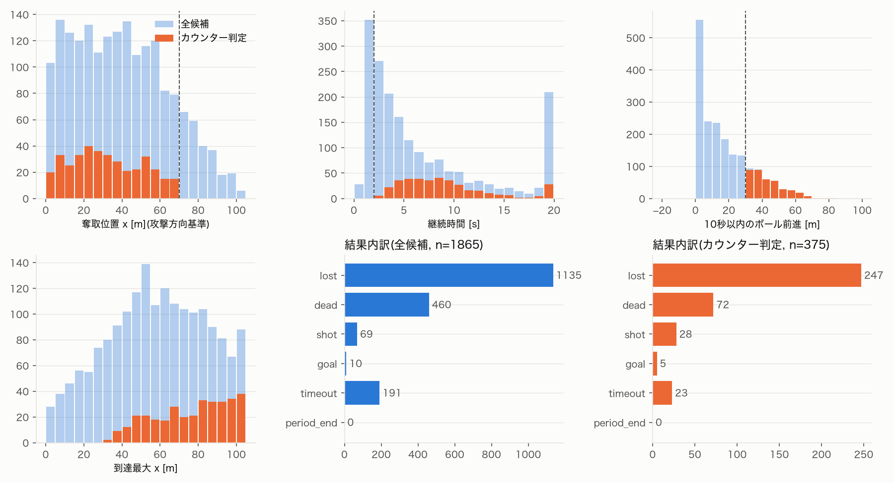

# データ確認・カウンター候補抽出レポート(2026-09-23)

対象: idsse-data 全7試合(Bundesliga 2022/23, TRACAB 25Hz)。
再現: `uv run python scripts/build_cache.py` → `uv run python scripts/extract_counters.py`

## 1. データ仕様の確認結果

| 項目 | 結果 |
|---|---|
| ピッチ | 全試合 105 × 68 m |
| フレームレート | 25 Hz、ピリオド内のフレーム欠落なし |
| 1フレームの選手数 | 常に22人(交代選手は出場中のみ記録) |
| 座標の向き | `STATIC_HOME_AWAY` 変換後、両ピリオドとも home が +x 方向へ攻撃(GK平均位置で確認) |
| ボール保持フラグ `ball_owning_team` | 全フレームで値あり。安定しており、5フレーム以下の揺れは 392 区間中 14 区間のみ |
| ボール状態 `ball_state` | alive / dead が全フレームで付与されている |
| イベント時刻の同期 | **試合ごとに ±1〜2秒ずれる**(パス位置とボール位置の最近接時刻で比較:中央値 −0.7〜+0.4 秒、四分位範囲はおよそ ±1.5 秒) |
| DFL生イベントの属性 | シュートに `xG` と `CounterAttack`(公式のカウンターフラグ)が付く。`CounterAttack` はシュートにのみ付与 |
| 奪取イベント(hs-pinn の判定) | 7試合で 621件。前後3秒以内に保持フラグの切り替わりがあるのは約68% |

キャッシュ: `data/cache/{match_id}_{frames,players,events}.parquet` と `_meta.json`(計126MB)。
kloppy からの読み込み 約45秒/試合 → キャッシュからの読み込みは数秒。

## 2. カウンター候補の定義(`src/off_shap/counter.py`)

イベント時刻がずれるため、シーンの境界はトラッキング側で決め、イベントはラベル付けにのみ使う。

- **始点**: インプレー中に保持チームが切り替わったフレーム(1秒未満の揺れは平滑化して除外。直前1秒もインプレーであることを要求し、リスタートを除外)
- **終点**: 相手への保持切り替わり(lost) / アウトオブプレー(dead) / 20秒経過(timeout)のいずれか最初
- **結果**: 区間内(終点後2秒の猶予を含む)に攻撃側のシュートがあれば shot / goal、なければ終点の種類
- **カウンター判定** `CounterCriteria`: 奪取位置 x ≤ 70m、継続時間 ≥ 2秒、10秒以内のボール前進 ≥ 30m(2026-09-23 に 15m から変更、4節参照)

hs-pinn との違い: hs-pinn は「奪取イベント時刻 + 5秒の固定窓」。本研究は可変長で、始点はトラッキングから決める。
奪取イベントとの対応の有無は `has_recovery_event` 列に残してある。

## 3. 抽出結果

- 候補(オープンプレーのターンオーバー): **1,865件**(1試合あたり 226〜296件)
- 初期条件(10秒で15m)でのカウンター判定: 743件 → **採用条件(10秒で30m)で 375件**(結果: lost 247 / dead 72 / timeout 23 / shot 28 / goal 5)
- **妥当性の確認**: DFL が `CounterAttack=true` を付けたシュート 13件のうち 12件をカウンターと判定(漏れた1件は奪取位置 75.5m で、敵陣深くでのショートカウンター)
- シュートで終わるシーンは到達最大 x の中央値が 104m で、攻撃方向の変換が正しいことも確認できた

### 前進距離の閾値による件数の変化

| 条件 | 件数 | shot/goal | DFLフラグ保持 |
|---|---|---|---|
| 10秒で15m以上(初期値) | 743 | 37 | 12/13 |
| 10秒で20m以上 | 600 | 37 | 12/13 |
| 10秒で25m以上 | 492 | 36 | 12/13 |
| **10秒で30m以上(採用)** | **375** | **33** | **12/13** |
| 5秒で20m以上 | 407 | 33 | 12/13 |
| 5秒で30m以上 | 175 | 19 | 10/13 |

## 4. 所見と未決事項

1. **暫定条件は緩すぎる可能性がある**。10秒で15m前進は通常のビルドアップも含む。閾値を「10秒で30m」まで上げても、shot/goal と DFLフラグはほとんど減らない(37→33、12/13 のまま)。
2. **シュートで終わるカウンターは少ない**(37件、判定済みの約5%)。v(S) を xG で終端評価するとほとんどのシーンで 0 になるため、Stage 1 ではピッチコントロールなどの連続的な空間指標を使う方針が妥当。
3. 奪取イベントとの対応率は16%と低い。パスミスのインターセプトなど、奪取イベントとして記録されないターンオーバーが多いため。奪取イベントがあるものに限ると件数が大きく減る。
4. 決定事項(2026-09-23):
   - カウンター判定は「10秒で30m以上前進」を採用する
   - 連合 S の対象は攻撃側フィールドプレイヤー全員(通常10人、2¹⁰ = 1,024 連合で厳密計算)。関与の薄い選手の φ が 0 に近づくこと自体を結果として示す。Stage 2 で人数を絞る場合に備え、対象範囲は後から変更できる設計にする

## 5. 前処理(ステップ3、`src/off_shap/scene.py`、`scripts/build_scenes.py`)

- シーンごとに攻撃方向基準の座標、Savitzky-Golay(7フレーム、2次)で平滑化した位置と速度、GK(連合からは除外し、空間指標用に別保持)、ボール位置を `data/processed/scenes/{scene_id}.npz` に保存
- 試合単位の分割: train 5試合 / valid J03WQQ / test J03WR9(Stage 2 で使用。Stage 1 は全試合で評価)
- **数的不利**: 攻撃側9人のシーンが39件。J03WN1(1チームが前半7分から10人)と J03WQQ(後半から10人)のレッドカードによる正常なデータ。Shapley 計算は人数可変なので残す
- **座標の飛び**: 平滑化前の速度が 12 m/s を超えるシーンが17件(99%点は 206 m/s。1フレームで数m〜11m 飛ぶトラッキングの異常)。`scenes_index.parquet` の `tracking_glitch` 列でフラグを立て、分析から除外する。**除外後 358シーン**(train 266 / valid 48 / test 44)

## 6. Shapley 値の計算エンジン(ステップ4-1、`src/off_shap/shapley.py`)

- v(S) の評価と Shapley 値の計算を分離。全 2ⁿ 連合の値をまとめて受け取るので、ピッチコントロールを連合方向にベクトル化して評価できる
- 厳密計算(n ≤ 16)と、Stage 2 向けの順列サンプリング近似(標準誤差付き)
- テストで効率性・対称性・ナル・プレイヤー・加法性と、既知のゲーム(手袋ゲームなど)の値を確認済み
