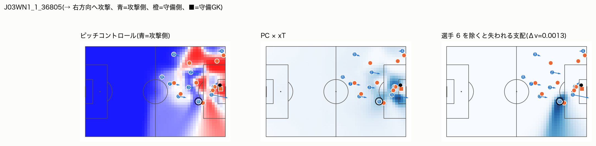
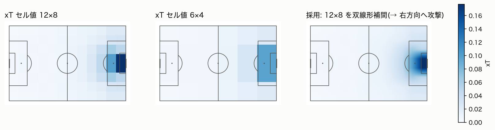
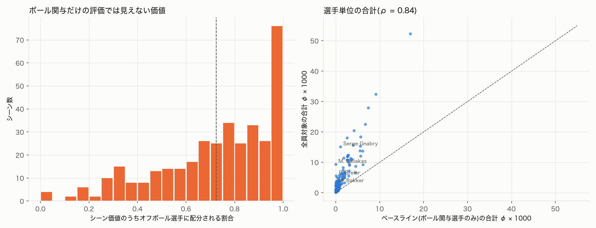
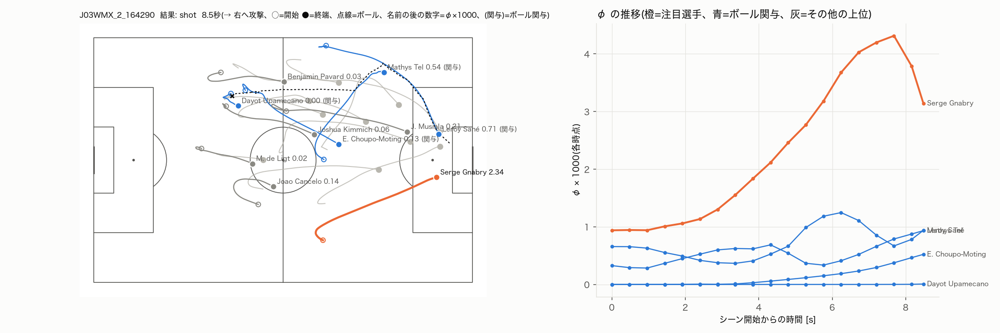
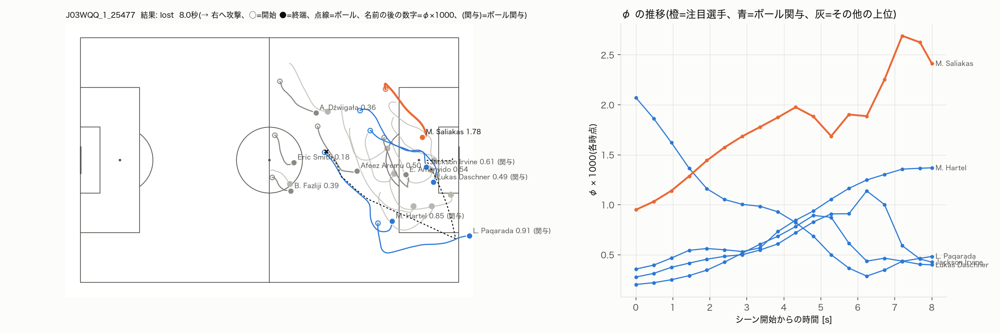
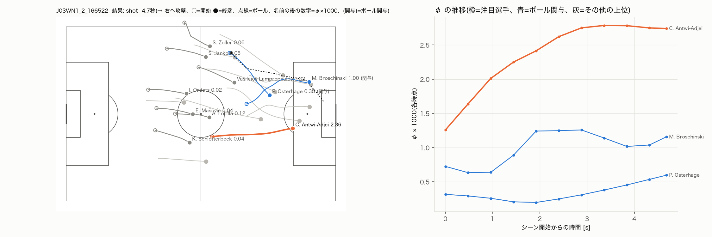

# 研究プレゼンテーション原稿

## 構成
- 研究背景
    - サッカーにおける主要な課題として大きなものに、オフボール評価や選手の貢献度の分解がある
    - 既存の指標はオンボール評価に偏り、オフボールの貢献をうまく定量化できていないと同時に選手
    - 先行研究で強力ゲーム理論のシャープレイを用いてサッカーのシュートシーンにおける選手の貢献度を分離するという研究はあるが、これもオンボールのみを対象としているのとトラッキングデータではなくイベントデータが対象でシーズン単位での貢献度分配
    みたいな話
- 研究目的
    - 強力ゲーム理論のシャープレイを用いて選手のオフボール評価・貢献度の分配を行う
- 先行研究
    -  Model-Based Restricted Shapley Value（resarch_plan.mdに説明を載せた論文）
    - 他にも論文はあるが、とりあえず上記の論文のみを紹介
    - そもそも強力ゲーム理論、シャープレイとは何かを簡単に説明->論文の紹介（価値関数の定義、二階建てモデルの説明、シャープレイをどのように計算しているのかフローチャートなどを使って）
- 提案手法
    - 提案手法の説明(stage1_worth.mdを参照)
    - まずピッチコントロール、xTの説明（それぞれ可視化した図も載せる）->価値関数の定義->シャープレイの計算方法（フローチャートなども載せる）
    - 実験条件（使用データなど）、ベースラインモデルの説明（先行研究との違いも含めて）
- 結果・考察
    - stage1_worth.mdの6.3 結果の内容を簡潔にまとめる
    - 図を挿入する（クロスに走り込む選手を評価できたことやベースラインでは過小評価している選手がいたり、オフボールの評価ができていないこと、ただデコイの動きには依然として対応できていないことなどに言及）
    - 解釈も入れる
- まとめ
    - 簡単にこれまでの内容（主に結果）をまとめる
- 今後の展望・方針
    - 次は軌道予測を入れることでデコイの動きも捉えられるようにするというstage2の話を簡潔にまとめる(stage2_design.md参照)

---

## 1. 研究背景

### 1.1 選手評価はボールに触ったプレーに偏っている

サッカーの選手評価では、xG(シュートの得点確率)、xT(ボールを運んだ場所の危険度)、VAEP(アクションの価値)などの指標が広く使われている。ただし、これらはどれも**選手がボールに触ったアクション(オンボールのプレー)を評価する指標**である。

選手がボールを持っている時間は1試合のうちごく一部で、大半の時間はボールを持たずに動いている(オフボール)。次のようなプレーはボールに触らないので、既存の指標には現れない。

- **走り込み**: 逆サイドからゴール前の空いたスペースへ走り込んだが、ボールは来なかった
- **デコイ(おとり)**: 相手の守備を引きつけて、味方のためのスペースを作った

### 1.2 貢献度の分解という課題

得点やチャンスは複数の選手の協力で生まれるが、その価値を個々の選手にどう分けるのが公平かは自明ではない。

例: あるカウンターに3人の選手が関わった。

| 選手 | プレー |
|---|---|
| A | ボールを運ぶ |
| B | 逆サイドへ走り込む(ボールには触らない) |
| C | 自陣に残る |

このチャンスの価値を3人にどう配分するか。特に、**ボールに触っていない B の取り分をどう測るか**が問題になる。

### 1.3 先行研究と残された課題

貢献度の分解に協力ゲーム理論の Shapley 値を用いた研究として、Cefis et al.「A Model-Based Restricted Shapley Value」がある(3節)。シュートに至る攻撃について、関与した選手に貢献度を配分する。ただし次の制約がある。

| | 先行研究 | 残された課題 |
|---|---|---|
| 対象選手 | ボールに関与した選手のみ | オフボール選手が評価されない |
| データ | イベントデータ(誰が、どこで、何をしたか) | ほかの選手の位置が分からず、空間的な評価ができない |
| 評価の単位 | 1チーム × 1シーズンで1つの評価 | 個々のシーンで誰が貢献したかは分からない |

著者ら自身も「トラッキングデータを用いたオフボール選手・空間的相互作用の組み込み」を今後の課題として挙げている。本研究はこの課題に取り組む。

## 2. 研究目的

**トラッキングデータと協力ゲーム理論の Shapley 値を用いて、オフボール選手を含む全選手の貢献度を、シーン単位で分解する。**

- **対象**: カウンターアタックのシーン。短時間に選手が大きく動き、ボールを持たない選手の走り込みが攻撃の成否に大きく関わるため
- **段階的に進める**

| 段階 | 内容 | 状況 |
|---|---|---|
| Stage 1(静的削除版) | 選手の座標を消し、攻撃側が押さえている空間がどれだけ減るかで貢献度を測る | 実装・評価済み(本発表の中心) |
| Stage 2(生成モデル版) | 選手がいなかった場合の守備の動きを生成モデルで作り、その世界で貢献度を測る | 設計中(7節) |

## 3. 先行研究

### 3.1 協力ゲーム理論と Shapley 値

**協力ゲーム**は、何人かのプレイヤーが協力して価値を生み、それを分け合う状況を表す枠組みである。サッカーに当てはめると次のようになる。

| 用語 | 意味 | サッカーでは |
|---|---|---|
| プレイヤー N | 価値を分け合う人たち | 選手 |
| 連合 S | プレイヤーの組み合わせ(S ⊆ N) | 「その選手たちだけがいたら」という組み合わせ |
| 価値関数 v(S) | 連合 S が生み出す価値 | その選手たちだけで生み出せる価値 |

**Shapley 値**は、全員がそろったときの価値の「公平な分け方」の1つである。選手が1人ずつピッチに加わっていくと考え、選手 i が加わった瞬間に v がいくつ増えたか(限界貢献)を、加わる順番の全パターンで平均したものを選手 i の取り分 φᵢ とする。

```
φᵢ = ∑[S ⊆ N∖{i}] |S|!(n−|S|−1)!/n! · (v(S∪{i}) − v(S))
```

#### 計算例

1.2節の3人について、v を仮に次のように置く。

| いる選手 | なし | A | B | C | A,B | A,C | B,C | A,B,C |
|---|---|---|---|---|---|---|---|---|
| v | 0 | 2 | 3 | 0 | 4 | 2 | 3 | 4 |

- C は自陣にいるので、誰と組んでも v は増えない
- A と B は押さえるスペースが一部重なるので、2 + 3 = 5 ではなく 4 になる

加わる順番の全パターン(3! = 6 通り)で、各選手が加わったときの上積みを記録して平均する。

| 加わる順番 | A の上積み | B の上積み | C の上積み |
|---|---|---|---|
| A → B → C | 2 | 2 | 0 |
| A → C → B | 2 | 2 | 0 |
| B → A → C | 1 | 3 | 0 |
| B → C → A | 1 | 3 | 0 |
| C → A → B | 2 | 2 | 0 |
| C → B → A | 1 | 3 | 0 |
| **平均 = φ** | **1.5** | **2.5** | **0** |

- 合計は 1.5 + 2.5 + 0 = 4 で、全員がそろったときの価値と一致する
- 先に加わるほど上積みが大きく、後から加わると重なりの分だけ小さくなる。この順番による有利・不利を全パターンで平均して打ち消すのが Shapley 値の「公平さ」

#### 性質

- **効率性**: 全員の φ の合計 = v(N) − v(∅)
- **対称性**: どの組み合わせでも同じだけ v を増やす2人の φ は等しい
- **ナル・プレイヤー**: どの組み合わせに加わっても v を増やさない選手の φ は 0

Shapley 値そのものは「分け方のルール」であり、**何を価値 v(S) とするかは別に決める必要がある**。この v(S) の決め方と、「選手を除く」操作の実現方法が、先行研究と本研究の主な違いになる。

### 3.2 A Model-Based Restricted Shapley Value(Cefis et al.)

> 注意: この節は論文の要約(`research_plan.md` 10.1節)にもとづく。数値・定義の細部は発表前に原典で確認すること。

#### 全体像: 2階建て構造

```
【1階】xGA モデル(XGBoost)          → 各ショットアクションの得点確率を予測(価値関数)
         ↓
【2階】Restricted Shapley Value      → その予測値を使って選手個人に貢献度を配分(配分ルール)
```

- データ: ショットアクション 8,421 件。WhoScored・Understat(イベントデータ)と Sofifa(選手能力値)を統合
- 対象: AC Milan と SSC Napoli の各15人

#### 1階: 価値関数 xGA

xGA(expected Goal Action)は、シュート単体ではなく**シュートに至る一連のアクションが得点につながる確率**で、XGBoost で予測する。

```
xGA_h = P(Y_h = 1 | X_h)     (Y_h = 1 ならゴール)
```

| 種類 | 入力特徴量 |
|---|---|
| シュート系 | シュート位置 X, Y、シュート角度 |
| アクション系 | 最初のパスの位置、パス本数、平均パス距離、ホーム/アウェイ、状況(オープンプレー/FK/PK など) |
| 選手構成 | **playersNb**(関与人数)、**plPerformanceIndex**(関与選手の能力値の平均、Sofifa 由来) |

playersNb と plPerformanceIndex は、「誰が何人で」というアクションの選手構成を表す唯一の入力で、次の「選手を除く」操作で使われる。

#### 2階: 制限付き Shapley 値と計算の流れ

```
ショットアクション 8,421 件
  ↓
XGBoost で xGA モデルを学習
  ↓
1チームの1シーズン分のアクションを、関与した選手の組み合わせ(連合)ごとに集める
  ↓
┌ 観測された連合     : その組み合わせで実際に起きたアクションの xGA を集計して υ(C) とする
└ 観測されていない連合: 実際のアクションを1つ土台に、playersNb と plPerformanceIndex だけを
                        評価したい連合のものに書き換えて xGA を予測する
  ↓
和を取る連合を「観測された、または戦術的に妥当な連合」に制限した Shapley 値(重みは制限した範囲で正規化し直す)
  ↓
ブートストラップ(B = 1,000)で標準誤差を求め、PRSV = φ ÷ 標準誤差 で選手を比較する
```

- **連合を制限する理由**: チームの選手全員の組み合わせは膨大だが、実際にピッチに立つ組み合わせはごく一部しかない(AC Milan の例で約19.9万通り中 431 通りが観測)。これがタイトルの「Restricted」
- **選手を除く操作**: 選手を空間的に消すのではなく、「関与人数を1人減らし、能力値の平均をその選手を除いたメンバーで計算し直す」。シュート位置やパスの経路は土台のアクションのまま
- **評価の単位**: 1チームの1シーズン全体を1つのゲームとする。限界貢献は「別の日の、別のアクションどうし」の比較になり、φ はシーズン単位の1つの数字になる

### 3.3 先行研究でオフボール選手を評価できない理由

先行研究が使うイベントデータには、**ボールに触った選手のアクションしか記録されていない**。ほかの選手が各瞬間にどこにいたかは分からないので、原理的に次の2つができない。

- 選手を空間的に消す(消す座標がない)
- スペースの支配のような空間的な価値を計算する(全選手の位置と速度が必要)

オフボールの効果は次の2種類に分けられる。

| | ① ボール関与選手のプレーを変える効果 | ② ボール関与選手のプレーを変えない効果 |
|---|---|---|
| 例 | デコイが守備を引きつけたので、味方が良い位置でシュートを打てた | 逆サイドの危険なスペースに走り込んだが、ボールは出なかった |
| 先行研究 | ボール関与選手の評価に入る(シュート位置などを通じて間接的に) | **誰の評価にもならない**(xGA の入力にオフボール選手の位置がない) |

本研究の Stage 1 はまず ② を、Stage 2 で ① をデコイ本人の貢献として評価することを目指す。

## 4. 提案手法(Stage 1: 静的削除版)

### 4.1 全体像

先行研究と同じく「価値関数(1階)」と「配分ルール(2階)」の2階建てだが、中身が異なる。

| | 先行研究 | 本研究 Stage 1 |
|---|---|---|
| データ | イベント | **トラッキング**(全選手・ボールの位置と速度、25 Hz) |
| 1階: 価値関数 | xGA(アクションの得点確率) | **ピッチコントロール × xT**(危険なスペースの支配) |
| 選手を除く操作 | 人数と能力値の平均を書き換える | **座標を消して計算し直す** |
| 2階: 配分ルール | 制限付き Shapley 値 | **全連合による厳密な Shapley 値** |
| ゲームの単位 | 1チーム × 1シーズン | **1シーン(の1フレーム)** |

以下、価値関数の材料となるピッチコントロール(4.2節)と xT(4.3節)、価値関数の定義(4.4節)、Shapley 値の計算方法(4.5節)の順に説明する。

### 4.2 ピッチコントロール

**「今この瞬間にボールがその地点に送られたら、攻撃側が先にボールを収める確率」**。Spearman (2018) "Beyond Expected Goals" の定式化を、Laurie Shaw が公開した実装(Friends of Tracking)に従って用いる。

計算の流れ(地点ごと):

1. **ボールの到達時刻**: ボール位置からその地点までの距離 ÷ ボール速度(15 m/s)
2. **各選手の到達時刻**: 反応時間(0.7 秒)の間は今の速度のまま進み、その後は最高速度(5 m/s)で直進する
   ```
   τᵢ(c) = τ_react + ‖c − (xᵢ + vᵢ·τ_react)‖ / v_max
   ```
3. **ボールの奪い合い**: ボール到達後、到達時刻を過ぎた選手ほど速くボールを収めていくとして、攻撃側・守備側がボールを収める確率を時間発展で計算する
   ```
   dP_att/dt = (1 − P_att − P_def) · ∑[i ∈ 攻撃側] λᵢ pᵢ(t)
   dP_def/dt = (1 − P_att − P_def) · ∑[j ∈ 守備側] λⱼ pⱼ(t)
   ```
   pᵢ(t) は時刻 t までに選手 i が間に合う確率(ロジスティック分布)、λ はボールを収める速さ
4. 最終的な P_att をピッチコントロールとする

- ピッチを 2m × 2m のマス(52 × 34 = 1,768 マス)に区切って計算する
- 選手の位置だけでなく、**走っている向きと速さ**も反映される



### 4.3 xT(Expected Threat)

**「その地点でボールを持ったとき、この先ゴールにつながる確率」**。Karun Singh (2018) のマルコフ連鎖による定式化に従う。

```
xT(c) = P_shot(c) · P_goal(c) + ∑[c'] T(c → c') · xT(c')
```

- 第1項: その地点でシュートして決まる確率
- 第2項: パスで別の地点 c' に移り、その先で決まる確率(T はパスによる移動の割合)
- 本研究のデータ(7試合)から自前で学習した。データが少ないため、マスを 12 × 8 と粗めにし、ゴール確率を全体平均に向けて縮小推定し、左右反転したものと平均し、マスの間は双線形補間で滑らかにした
- 値は相手ゴール正面で 0.2 前後、自陣では 0.005 前後



### 4.4 価値関数 v(S)

v(S) は、**選手の組み合わせ S だけが攻撃側としてピッチにいたとき、相手陣内の危険なスペースをどれだけ押さえられているか**を1つの数値にしたもの。

```
v(S) = (1 / ピッチ面積) · ∑[マス c] PC_S(c) · w(c) · ΔA
w(c) = xT(c) × [c が相手陣内]
```

| 記号 | 意味 |
|---|---|
| PC_S(c) | 連合 S のときに、攻撃側がマス c を支配する確率(4.2節) |
| w(c) | マス c の危険度。相手陣内の xT(4.3節)、自陣は 0 |
| ΔA | 1マスの面積(約 4 m²) |

**計算に入れる選手**

| | 選手 |
|---|---|
| 攻撃側 | 連合 S に含まれるフィールドプレイヤーと攻撃側 GK |
| 守備側 | フィールドプレイヤー全員と GK(記録どおりの位置) |

**読み方**: 「ピッチ上のランダムな地点にボールを送ったとき、攻撃側が手にする xT の期待値」。ゴール前の危険な場所を押さえているほど大きくなる。

**相手陣内に限った理由**: ピッチ全体の xT を重みにすると、自陣は xT が小さい代わりに面積が広いため、自陣の支配が v の 39〜50% を占め、最終ライン付近に残っているだけの選手にもカウンターの脅威とは無関係な貢献が付いた。相手陣内に限っても、v とシュートの結果との対応(AUC)はほぼ変わらなかった。

**性質**: 選手を加えても v は下がらない(ピッチコントロールの性質)ので、φ は必ず 0 以上になる。

### 4.5 Shapley 値の計算方法

```
トラッキングデータ(7試合)
  ↓
カウンターアタックのシーンを抽出(358 シーン、4.6節)
  ↓
各シーンから 0.5 秒ごと + 最後の瞬間のフレームを取り出す(1シーン平均 約20フレーム)
  ↓
各フレームで、攻撃側フィールドプレイヤー10人の全ての組み合わせ(2¹⁰ = 1,024 通り)について
  連合に入っていない選手の座標を消す → ピッチコントロール → × 相手陣内の xT → v(S)
  ↓
1,024 個の v(S) から厳密な Shapley 値 φ を計算
  ↓
シーン内で平均 → そのシーンでの各選手の貢献度
  ↓
選手ごとに複数シーンを集計 → 選手の評価
```

- **全ての組み合わせを計算している(近似なし)**。攻撃側10人なら 1,024 通り、レッドカードで9人なら 512 通り
- v(S) の計算は合計約 704 万回。ピッチコントロールで攻撃側が「ボールを収める速さ」は連合の選手の分の足し合わせになるので、各選手の分を1回計算しておけば 1,024 通りを行列の掛け算でまとめて計算できる。1フレーム約 0.9 秒、全シーンを8並列で約 50 分
- 効率性(φ の合計 = v(N) − v(∅))は 10⁻¹⁰ の精度で成り立つことを確認した
- 先行研究のように連合を制限する必要はない。1シーンの中の10人について「この選手がいなかったら」を考えるので、どの部分集合も反実仮想として計算できる

### 4.6 実験条件

#### データ

- DFL が公開する idsse-data: ブンデスリーガ 2022/23 シーズンの7試合、トラッキング(25 Hz)とイベントデータ
- 前処理: 位置を Savitzky-Golay フィルタ(7フレーム、2次)で平滑化して速度を計算

#### カウンターアタックの定義

| 項目 | 定義 |
|---|---|
| 始点 | ボールを奪った瞬間(トラッキングのボール保持フラグから判定。1秒未満の揺れは除外) |
| 終点 | ボールを失う / アウトオブプレー / 奪ってから 20 秒経過 のうち最初 |
| カウンター判定 | 奪った位置が x ≤ 70 m、2 秒以上続く、10 秒以内に 30 m 以上前進 |

- 抽出結果: 375 シーン → 座標の異常(トラッキングの飛び)がある 17 シーンを除き **358 シーン**(シュート・ゴールで終わったもの 32 シーン)
- 妥当性: DFL が公式にカウンターと記録したシュート 13 件のうち 12 件を抽出できた


### 4.7 ベースライン: ボール関与選手だけを対象にした場合

#### 比較する2条件

| | 提案手法(全員対象) | ベースライン(ボール関与選手のみ) |
|---|---|---|
| 連合の対象 | 攻撃側フィールドプレイヤー全員(通常10人) | そのシーンでボールに関与した選手だけ(平均3人) |
| 対象外の選手 | ― | 常にピッチにいるものとして固定する。φ は 0 |
| 価値関数・フレーム・集計 | 共通 | 共通 |

- 「ボールに関与した」: シーン中に1フレームでも、ボールとの距離が 1.5 m 未満になった選手
- 計算: ボール関与選手の集合を On、それ以外を Off として、v'(T) = v(T ∪ Off)(T ⊆ On)の部分ゲームの Shapley 値を求める。保存済みの v(S) から取り出すだけで計算できる
- Off を「常にいる」とした理由: Off の選手自身が押さえるスペース(オフボールの効果②)は誰の評価にもならず、デコイが作ったスペース(①)はそれを押さえているボール関与選手の評価に入る。先行研究のオフボールの扱いに最も近い

#### 先行研究との関係

このベースラインは**先行研究の手法の再現ではない**。先行研究と同じく「連合をボール関与選手に限る」条件だけを取り入れ、ほかの条件はすべて提案手法とそろえた比較条件である。

- 示したいのは「連合をオフボール選手まで広げると何が見えるようになるか」なので、**連合の範囲だけを変えて比べる**のが正しい実験設計である。価値関数と連合の範囲の両方が違う手法どうしを比べると、差の原因を切り分けられない
- 先行研究の手法そのものは、データの制約でも適用できない。xGA モデルの学習に必要なシュート数が足りず(先行研究 8,421 件、本データは7試合で 171 本)、選手の能力値(Sofifa)も手元にない
- このため、「先行研究の手法より優れている」という主張には使えない。言えるのは「連合をボール関与選手に限ると、何が見えなくなるか」である

## 5. 結果・考察

### 5.1 ボール関与選手だけの評価では、シーンの価値の大部分が見えない

- 提案手法でオフボール選手に配分される φ は、シーンの価値の**平均 72%**(中央値 77%)。81% のシーンで半分以上を占める
- ベースラインの φ の合計は、提案手法の合計の**中央値 20%** にとどまる。残りの約 80% は「常にいる」とした Off の分に吸収され、誰の評価にもならない

**解釈**: ボール関与選手だけの評価は、オフボール選手の価値をボール関与選手に付け替えているのではなく、評価の対象外として丸ごと捨てている。

### 5.2 1人あたりで見ると、オフボール選手とボール関与選手はほぼ同じ

| | ボール関与 | オフボール |
|---|---|---|
| 選手-シーンあたりの φ の平均(× 10⁻³) | 0.213 | 0.209 |
| 中央値(× 10⁻³) | 0.112 | 0.075 |

**解釈**: 5.1節の 72% は、オフボール選手が1人あたり特に高く評価されているからではなく、人数が多い(1シーンに約7人)ことによる部分が大きい。重要なのは、オフボール選手が「ほとんど貢献しない多数」と「大きく貢献する少数」に分かれることで、その上位にいるのが 5.4節の事例のような選手である。

### 5.3 ベースラインで過小評価される選手

8シーン以上に出場した118人について、選手ごとに φ を合計して順位を付けた。提案手法とベースラインの順位相関は **ρ = 0.84** で、大筋では一致する。ただし、ベースラインで大きく過小評価される選手がいる。

| 選手 | チーム | シーン数 | ボール関与率 | 提案手法の順位 | ベースラインの順位 |
|---|---|---|---|---|---|
| M. Saliakas | St. Pauli | 18 | 0% | 26 | 117 |
| P. Breier | Hansa Rostock | 16 | 19% | 43 | 96 |
| M. Bakker | Leverkusen | 35 | 23% | 66 | 106 |
| Serge Gnabry | Bayern | 30 | 20% | 10 | 49 |

- ボールにはあまり触らないが、相手陣内の危険なスペースを押さえている選手。サイドの選手と FW が多い
- ポジション別では、ウイング・FW・サイドMF の φ が高く(0.35〜0.42 × 10⁻³)、CB は低い(0.05 × 10⁻³)。カウンターで前線に出ていく選手ほど高いという直感と合う
- ボール関与選手の φ も、ベースラインのほうが小さい(ベースライン ÷ 提案手法の中央値 0.85)。ピッチコントロールでは選手が増えるほど1人を加えたときの上積みが小さくなる(押さえるスペースが重なる)。ベースラインでは関与選手は常に「オフボール選手が全員いる」状態に加わるので、上積みが小さく評価される



### 5.4 事例: 逆サイドからの走り込み

| 事例 | シーン | 結果 | 注目選手(オフボール) | φ × 1000 | 2位(ボール関与) |
|---|---|---|---|---|---|
| 1 | J03WMX_2_164290 | シュート | Serge Gnabry(逆サイドからファーへ) | 2.34 | Leroy Sané 0.71 |
| 2 | J03WQQ_1_25477 | ボールロスト | M. Saliakas(逆サイドからエリア内へ) | 1.78 | L. Paqarada 0.91 |
| 3 | J03WN1_2_166522 | シュート | C. Antwi-Adjei(逆サイドからエリアへ) | 2.36 | M. Broschinski 1.00 |

- 3事例とも、**ボールと反対側からゴール前の空いたスペースへ走り込む選手**の φ が最も高く、走り込むにつれて φ が上がっていく
- 事例1では、ボールに触っていない Gnabry の φ が、ボールを運んだ Sané の約3倍
- 事例2はシュートに至らずボールを失ったシーンだが、走り込みの価値を評価できている。実際に起きたシュートの結果ではなく、その瞬間のスペースの押さえ方で評価しているため





### 5.5 考察

**言えること**

- 連合をボール関与選手に限ると、シーンの価値の大部分(提案手法の配分で約7割)が評価の対象外になる
- その中には、危険なスペースに自分で走り込むオフボールの動き(3.3節の ②)による大きな貢献が含まれる。これはボール関与だけの評価では原理的に見えない
- その結果、ボールにあまり触らないサイドの選手や FW が、ボール関与だけの評価では大きく過小評価される

**言えないこと**

- **デコイが守備を引きつけて味方のスペースを作る効果(3.3節の ①)**。Stage 1 では選手を消しても守備側は記録どおりの位置に残るので、デコイを消しても守備は引きつけられたままになる。デコイが作ったスペースは、デコイ本人ではなく、そのスペースを押さえている別の選手の貢献になる。事例でも、守備を引きつけた選手が高く評価されているわけではない
- **先行研究の手法より優れている**こと(ベースラインは先行研究の再現ではない、4.7節)
- **オフボール選手が1人あたりで特に高く評価される**こと(5.2節)

**注意点**

- 相手陣内のスペースしか数えないため、ハーフウェーライン手前でボールを持つ選手の φ はほぼ 0 になる
- 「ボール関与」の判定はボールとの距離による近似
- データは7試合で、全試合に同じチーム(デュッセルドルフ)が出ており、選手-シーンの 35% を占める。他チームの選手はシーン数が少なく、順位は不安定
- 統計的な検定はしていない

## 6. まとめ

- トラッキングデータと Shapley 値を用いて、オフボール選手を含む全選手の貢献度をシーン単位で分解する手法(Stage 1)を構築した
  - 価値関数: ピッチコントロール × 相手陣内の xT(相手陣内の危険なスペースの支配)
  - 選手の座標を消して計算し直し、全 1,024 連合で厳密な Shapley 値を計算した
- カウンターアタック 358 シーンで評価した
  - シーンの価値の約7割がオフボール選手に配分され、ボール関与選手だけの評価ではその大部分が見えない
  - 逆サイドからの走り込みのようなオフボールの貢献を評価でき、ボール関与だけの評価で過小評価される選手(Saliakas、Gnabry など)を見つけられた
- 課題: デコイが守備を引きつける効果は評価できていない

## 7. 今後の展望: Stage 2(生成モデル版)

### 7.1 目的

「**その選手がいなかったら、守備はどう動いたか**」を生成モデルで作り、その世界で v(S) を計算し直す。デコイがいなければ守備は引きつけられず別の位置にいたはずなので、デコイが作ったスペースをデコイ本人の貢献として評価できるようになる。

| | 先行研究 | Stage 1(今回) | Stage 2(今後) |
|---|---|---|---|
| 選手を除く操作 | 人数と能力値の平均を書き換える | 座標を消す | 守備の軌道を生成し直す |
| 除いた選手の影響がほかの選手に及ぶか | 及ばない | 及ばない | 及ぶ |
| デコイの効果(①) | デコイ本人には入らない | デコイ本人には入らない | デコイ本人に入る |

### 7.2 設計方針

- **攻撃側とボールの動きを条件にして、守備側の軌道だけを生成する**。外す選手は入力から消すだけで、攻撃側の残りの選手とボールは記録どおりに固定する。Stage 1 との違いを「守備が反応するかどうか」だけに絞るため
- **各時刻の守備は、その時刻までの攻撃側とボールの動きだけを見て決める**(未来を見ない)
- **段階的に作る**: まず決定論的なモデル(2a)で「選手を外す → 守備を生成し直す → v(S) → φ」のパイプラインを通し、その後、守備の複数の反応をサンプリングできる生成モデル(CVAE、2b)に拡張する。決定論的なモデルは起こりうる動きの平均を出すので、「ついていく」か「持ち場に残る」かの中間の位置が出て、デコイの効果が薄まるおそれがある
- **価値関数と Shapley 値の計算は Stage 1 と同じ**にし、Stage 1 との差を「守備の反応の効果」として示す

### 7.3 検証

「このシーンで B がいなかったら守備はどう動いたか」は現実には起きておらず、正解データがない。そのため次の方法で間接的に確かめる。

- **合成データでの検証**: 守備のルールを自分で決めたシミュレーション(例: 最も近い攻撃側をマークする)でデータを作れば、「B を消した世界」の正解も手に入る。モデルがそれを再現できるかを確かめる
- **予測精度・挙動の確認**: 別の試合の守備の動きをどれだけ予測できるか、外した選手をマークしていた守備者が別の選手やボールのほうへ移るか
- **レッドカードのシーンとの比較**: 実際に攻撃側が10人だったシーンの守備の動きと、分布として似ているか

### 7.4 検討中の論点

- **ボールに関与した選手の扱い**: ボールを持っていた選手を外すと「持ち主のいないボールが動く世界」になる。守備モデルにはボール関与選手を常に見せ、オフボール選手を外したときだけ守備を生成し直す案を検討している
- **削除か、平均的な選手への置き換えか**: 削除の φ には「前線にいる役割だから誰でも押さえられる」ポジションの分も含まれる。「普通の選手と比べてどれだけ上乗せしたか」を測る置き換え版も、Stage 1・Stage 2 の両方で比較する予定
