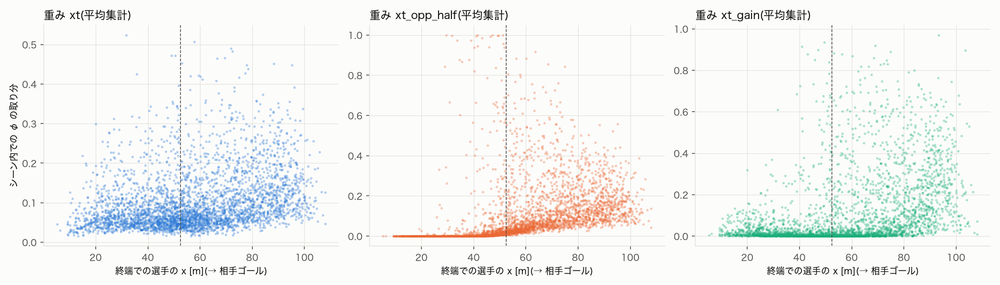
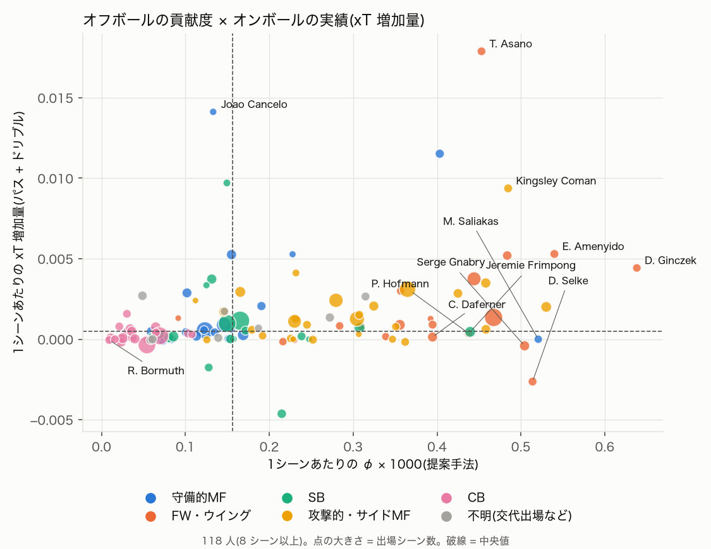
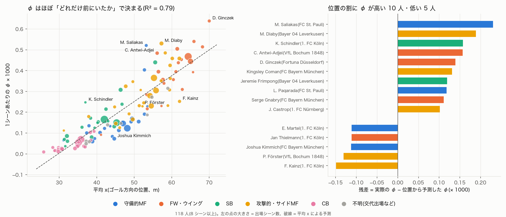

# Stage 1(静的削除版)worth 関数レポート(2026-09-23)

再現:
```
uv run python scripts/build_xt.py            # xT の学習
uv run python scripts/check_pitch_control.py # 目視確認用の図
uv run python scripts/compute_stage1.py      # 全シーンの v(S) と φ(8並列で約30分)
uv run python scripts/analyze_stage1.py      # 集計と比較
uv run python scripts/compare_baseline.py    # ボール関与選手だけのベースラインとの比較(6節)
uv run python scripts/plot_offball_vs_onball.py  # オンボールの実績との散布図(8節)
uv run python scripts/analyze_position_adjusted.py  # 位置で調整した φ(8.7節)
```

## 1. 定義

### 1.1 価値関数 v(S)

v(S) は、**選手の組み合わせ S だけが攻撃側としてピッチにいたとき、相手陣内の危険なスペースをどれだけ押さえられているか**を1つの数値にしたもの。

```
v(S) = (1 / ピッチ面積) · ∑[マス c] PC_S(c) · w(c) · ΔA
```

| 記号 | 意味 |
|---|---|
| c | ピッチを 2m × 2m に区切ったマス(52 × 34 = 1,768 マス) |
| PC_S(c) | 組み合わせ S のときに、攻撃側がマス c を支配する確率(0〜1、1.2節) |
| w(c) | マス c の危険度(重み)。主指標では w(c) = xT(c) × [c が相手陣内](1.3節、3節) |
| ΔA | 1マスの面積(約 4 m²) |

**計算に入れる選手**

| | 選手 |
|---|---|
| 攻撃側 | **S に含まれるフィールドプレイヤー**と攻撃側 GK(GK は常にいる) |
| 守備側 | フィールドプレイヤー全員と GK(常に記録どおりの位置。静的削除) |

#### 読み方: 期待値として

v(S) は次のように書き直せる。

```
v(S) = E[ PC_S(c) · w(c) ]     (c はピッチ上から一様ランダムに選んだ地点)
```

つまり「**ピッチ上のランダムな地点にボールを送ったとき、攻撃側が手にする xT の期待値**」である(攻撃側が先に収めればその地点の xT、自陣なら 0、守備側に取られれば 0)。

ただし「一様ランダムな地点に送る」という仮定は現実的ではない(実際のボールは味方がいる場所やパスが通る場所にしか送られない)。そのため v(S) は、そのチームが次に得る xT の期待値でもゴール確率でもない。あくまで「相手陣内の危険な場所を、ピッチ全体としてどれだけ押さえているか」を、各地点を同じ重みで数えた量である。ボールがどこに送られやすいかの確率 P(c) を掛ければ実際の期待値に近づく(Fernández ら (2019) の EPV の考え方)が、P(c) を学習するモデルが別に必要で、7試合では難しいため採用していない。

#### 読み方: 合計・面積として

| 形 | 式 | マスの大きさを変えると | 意味 |
|---|---|---|---|
| A. 単純な合計 | ∑ PC·w | 変わる(マスを 1m にすると約4倍) | 特になし |
| B. 面積付きの合計(積分) | ∑ PC·w·ΔA | 変わらない | 「xT で重み付けした支配面積」(単位 m²) |
| C. 平均(採用) | ∑ PC·w·ΔA ÷ ピッチ面積 | 変わらない | 上の期待値 |

ΔA を掛けた時点(B)でマスの大きさによらない値になり、ピッチ面積で割る(C)のは期待値として解釈できるようにするため。A・B・C は互いに定数倍なので、**Shapley 値の順位や選手どうしの比はどれを使っても同じ**。

B で読むと直感的になる。v(N) の中央値 1.72 × 10⁻³ にピッチ面積 7,140 m² を掛けると約 12.3 m²で、「xT が 0.1 の場所を約 123 m²(ペナルティエリアの約 1/5)押さえているのと同じ」程度の脅威になる。

#### 値の大きさ(主指標 `xt_opp_half`、各シーンで平均した値、× 10⁻³)

| | 値 |
|---|---|
| 上限(相手陣内をすべて完全に支配した場合) | 15.9 |
| v(N)(全員がいる場合)の中央値 | 1.7(上限の約 11%) |
| v(N) の範囲(下位 10%〜上位 10%) | 0.2 〜 4.4 |
| v(∅)(フィールドプレイヤーが誰もいない場合) | ほぼ 0(攻撃側 GK だけでは相手陣内は守備側がすべて押さえる) |

v を上限の 15.9 で割ると「相手陣内の脅威のうち何割を攻撃側が押さえているか」(0〜1)として読める。

#### 性質

- **選手を加えても v は下がらない**(ピッチコントロールの性質)→ Shapley 値 φ は必ず 0 以上になる
- **全員の φ の合計は v(N) − v(∅) ≈ v(N)**。そのシーンで押さえていた脅威を10人で分け合った値

#### この定義が測らないもの

- **ボールを持っていること自体**: ボールの位置は「ボールがマスに届くまでの時間」にしか使わない。ボール保持者が評価されるのは、その選手が周りのスペースを押さえている分だけ
- **パスが実際に通るか**: 途中でカットされる可能性やパスコースの有無は入っていない
- **オフサイド**: オフサイドの位置で押さえているスペースも数える
- **他の選手の反応**: 静的削除なので、選手を消しても守備側は記録どおりの位置に残る(4節)

### 1.2 ピッチコントロール PC_S(c)

**「今この瞬間にボールがマス c に送られたら、攻撃側が先にボールを収める確率」**。Spearman (2018) "Beyond Expected Goals"(MIT Sloan Sports Analytics Conference)の定式化を、Laurie Shaw が簡略化して公開した実装(Friends of Tracking の LaurieOnTracking、`Metrica_PitchControl.py`)に従う。

#### 計算の流れ(マスごと)

1. **ボールの到達時刻**: ボール位置からマス c までの距離 ÷ ボール速度
2. **各選手の到達時刻**: 反応時間の間は今の速度のまま慣性で動き、その後は最高速度でマス c へ直進する
   ```
   τᵢ(c) = τ_react + ‖c − (xᵢ + vᵢ·τ_react)‖ / v_max
   ```
3. **ボールの奪い合い**: ボール到達後、各選手が「到達時刻を過ぎた度合い」に応じた速さでボールを収めていく。時刻 t までに選手 i が間に合う確率はロジスティック分布
   ```
   pᵢ(t) = 1 / (1 + exp(−π/(√3·σ) · (t − τᵢ(c))))
   ```
   攻撃側・守備側が収める確率 P_att、P_def は次の式で時間発展する
   ```
   dP_att/dt = (1 − P_att − P_def) · ∑[i ∈ 攻撃側] λᵢ pᵢ(t)
   dP_def/dt = (1 − P_att − P_def) · ∑[j ∈ 守備側] λⱼ pⱼ(t)
   ```
4. 最終的な P_att が PC_S(c)

#### パラメータ(Shaw の実装の既定値。コードで確認済み)

| パラメータ | 値 | 意味 |
|---|---|---|
| max_player_speed | 5 m/s | 最高速度 |
| reaction_time | 0.7 s | 反応時間 |
| tti_sigma | 0.45 s | 到達時刻の不確実性 σ |
| lambda_att / lambda_def | 4.3 /s | ボールを収める速さ(攻守共通) |
| kappa_def | 1 | 守備側の有利さ(lambda_def = 4.3 × kappa_def) |
| lambda_gk | lambda_def × 3 | 守備側 GK のみ(手を使えるので速く収める)。攻撃側 GK は lambda_att |
| average_ball_speed | 15 m/s | ボールの速度(直進) |
| max_player_accel | 7 m/s² | コードに「not used」と明記。使われていない |

#### Shaw の実装での簡略化(原論文との違い)

- ボールは一定速度で直進、選手は加速度を考えず「反応時間 + 最高速度で直進」(加速度のパラメータは未使用とコードに明記)
- kappa_def = 1(攻守対等)。コードのコメントは「kappa parameter in Spearman 2018」
- **要原典確認**: 原論文の κ の値、ボール軌道・選手の運動のモデルの詳細。論文に書く前に Spearman (2018) で確認すること

#### 本研究の実装で変えた点(`src/off_shap/pitch_control.py`)

| | Shaw の実装 | 本研究 |
|---|---|---|
| 計算単位 | 1地点ずつループ | 1,024 連合 × 全マスを行列積でまとめて計算 |
| 数値積分 | Euler 法、刻み 0.04 s | 各ステップで未コントロール確率を厳密に指数減衰させる方式、刻み 0.1 s(Shaw 方式との差は最大 0.013、2節) |
| 積分時間 | 10 s | 10 s(同じ) |
| オフサイドの攻撃側選手 | 除外する処理がある | 除外しない |
| 近道 | 一方が圧倒的に速い地点では 0/1 に打ち切る | 打ち切らない(積分すれば同じ値に収束する) |
| 収束判定 | P_att + P_def > 0.99 で打ち切り | 打ち切らず積分時間いっぱいまで計算 |

#### 採用しなかった定義

- **Fernández & Bornn (2018) "Wide Open Spaces"**: 各選手の影響範囲を2次元正規分布で表す方式
- **ボロノイ図**: 一番近い選手の領域とする方式。速度を使わず、確率にもならない

Spearman 型にしたのは、速度と到達時間を物理的に扱えて、公開実装と突き合わせて検証できるため。

### 1.3 xT(Expected Threat)

**マス c でボールを持ったとき、この先ゴールにつながる確率**。Karun Singh "Introducing Expected Threat (xT)"(ブログ、2018)のマルコフ連鎖による定式化に従い、idsse-data 7試合から自前で学習した(`src/off_shap/xt.py`)。

```
xT(c) = P_shot(c) · P_goal(c) + ∑[c'] T(c → c') · xT(c')
```

- P_shot(c): マス c でのアクション(パス・シュート)のうちシュートの割合
- P_goal(c): マス c からのシュートが決まる確率
- T(c → c'): マス c でのアクションのうち、成功したパスで c' へ移る割合(失敗パスは遷移先なし = 価値 0)
- 右辺第1項は「ここでシュートして決まる確率」、第2項は「パスで別のマスへ移り、その先で決まる確率」。30回反復して収束させる

#### Singh の元の定義との違い

| | Singh (2018) | 本研究 |
|---|---|---|
| 学習データ | 大規模なイベントデータ | idsse-data 7試合(パス 6,062、シュート 171、ゴール 19) |
| マス | 16 × 12 | **12 × 8**(7試合では 16 × 12 はデータが少なすぎる) |
| 移動 T | パスとドリブル | **パスのみ**(DFL のイベントにドリブルがない) |
| ゴール確率 | 各マスのシュートからそのまま推定 | **全体平均に向けて縮小推定**(シュート10本分の事前分布) |
| 左右 | 非対称のまま | **左右反転したものと平均**(シュートが少なく、左右差はほぼノイズのため) |
| マスの間 | 階段状(マス内は一定) | **双線形補間で滑らかにする** |

**自前で学習した理由**: Singh の数値グリッドは再利用しやすい形で公開されていない。また、他リーグで学習した値を借りるより、同じデータで学習したほうが整合する(hs-pinn と同じ判断)。

**弱点**: データが少なく値は粗い。特にゴール前のマスはシュート数が少なく不安定。研究室の J.League データで学習し直すか、公開されている大規模データ(StatsBomb Open Data など)で学習した xT に差し替える価値がある。

### 1.4 Shapley 値 φ と連合

#### φ とは

φ(ファイ)は、**そのシーンで攻撃側全体が生み出した価値のうち、その選手1人の取り分**。協力ゲーム理論の Shapley 値という「公平な分け方」で計算する。選手 i の取り分を φᵢ と書く。

```
φᵢ = ∑[S ⊆ N∖{i}] |S|!(n−|S|−1)!/n! · (v(S∪{i}) − v(S))
```

式の意味は、「選手が1人ずつピッチに加わっていくとき、選手 i が加わった瞬間に v がいくつ増えたか(限界貢献)を、加わる順番の全パターンで平均したもの」。

#### 小さな例

3人の攻撃側選手がいるとする。

- **A**: ボールを運ぶ選手
- **B**: 逆サイドへ走り込む選手
- **C**: 自陣に残っている選手

v を仮に次のように置く。

| いる選手 | なし | A | B | C | A,B | A,C | B,C | A,B,C |
|---|---|---|---|---|---|---|---|---|
| v | 0 | 2 | 3 | 0 | 4 | 2 | 3 | 4 |

- C は自陣にいるので、誰と組んでも v は増えない
- A と B は押さえるスペースが一部重なるので、2 + 3 = 5 ではなく 4 になる

全員そろったときの価値 4 を3人で分ける。選手が加わる順番の全パターン(3! = 6 通り)で、各選手が加わったときの上積みを記録し、平均する。

| 加わる順番 | A の上積み | B の上積み | C の上積み |
|---|---|---|---|
| A → B → C | 2 | 2 | 0 |
| A → C → B | 2 | 2 | 0 |
| B → A → C | 1 | 3 | 0 |
| B → C → A | 1 | 3 | 0 |
| C → A → B | 2 | 2 | 0 |
| C → B → A | 1 | 3 | 0 |
| **平均 = φ** | **1.5** | **2.5** | **0** |

- φ_A = 1.5、φ_B = 2.5、φ_C = 0 で、合計は 4 = v(A,B,C)
- 先に加わるほど上積みが大きく、後から加わると重なりの分だけ小さくなる。この順番の有利・不利を全パターンで平均して打ち消すのが Shapley 値の「公平さ」
- 何も増やさない C は 0 になる

#### 性質(テストで確認済み、`tests/test_shapley.py`)

- **効率性**: 全員の φ の合計 = v(N) − v(∅)。本研究では v(∅) ≈ 0 なので、φ の合計はそのシーンの v(N)(攻撃側全体で押さえていた脅威)になる
- **対称性**: どの組み合わせでも同じだけ v を増やす2人の φ は等しい
- **ナル・プレイヤー**: どの組み合わせに加わっても v を増やさない選手の φ は 0
- **非負性(本研究の v に固有)**: v は選手を加えても下がらない(1.1節)ので、φ は必ず 0 以上

#### 本研究での φ

- 攻撃側10人の全組み合わせの v から、上と同じ計算をする(式は加わる順番の平均と等価で、10! 通りの順番を列挙する必要はない)
- シーン中 0.5 秒ごとに φ を計算し、シーン全体で平均する(1.5節の平均集計)
- 図や表の「φ × 1000」は見やすくするために 1,000 倍した値。例: 事例1(6.4節)の Gnabry は 2.34 で、2位の Sané(0.71)の約3倍の取り分

#### 連合: 全パターンを計算している

「連合」は、上の例の「いる選手の組み合わせ」のこと。連合の対象は攻撃側フィールドプレイヤー全員(GK は除く)で、**すべての組み合わせを計算している(近似なし)**。

| 攻撃側の人数 | 組み合わせの数 | シーン数 |
|---|---|---|
| 10人(通常) | 2¹⁰ = 1,024 通り | 321 |
| 9人(レッドカードで数的不利) | 2⁹ = 512 通り | 37 |

- これを各シーンの 0.5 秒ごと+終端のフレームで計算する。1シーンあたり平均 20.1 フレーム(最小 6、最大 43)
- **v(S) の計算回数は合計約 704 万回**

**全パターンを計算できた理由**: 組み合わせ S のときの「攻撃側がボールを収める速さ」は、S に含まれる選手の分の足し合わせになる(1.2節)。各選手の分を1回だけ計算しておけば、1,024 通りは行列の掛け算1回でまとめて求められる。1フレームの 1,024 通りが約 0.9 秒で、全シーンを8並列で約50分で計算した。

**全パターンを計算した利点**

- Shapley 値が厳密に出る。近似の誤差がなく、φ の合計は v(N) − v(∅) と 10⁻¹⁰ の精度で一致する
- 全組み合わせの v(S) を保存しているので、ボール関与選手だけのベースライン(6節)は、保存済みの値の一部を取り出すだけで計算できる。重み w を変える場合も、ピッチコントロールから計算し直す必要はない(3節)

**Stage 2 では事情が変わる**: 組み合わせごとに「その選手たちがいない場合の軌道」を生成モデルで作る必要があり、1回が重く、足し合わせの工夫も使えない。1,024 通りの全計算は難しくなる見込みで、順列サンプリングによる近似(`shapley.permutation_shapley`、標準誤差付き)を使うか、連合の対象を5〜6人程度に絞るかを、Stage 2 の設計時に決める。

#### 時間方向

シーン内の 0.5 秒ごと+終端のフレームで全連合の値を保存し、集計(終端 / 平均)は後段で選ぶ。Shapley 値は v に線形なので、平均した v の φ はフレームごとの φ の平均と一致する。

### 1.5 用語: 終端と平均

**終端**は、1つのカウンターシーンの最後のフレーム(最後の瞬間)を指す。シーンの区切りは次のとおり(`documents/data_exploration.md` 2節)。

```
始点: ボールを奪った瞬間
  ↓
終端: 次のうち最初に起きた瞬間の直前
  ・相手にボールを奪われた(lost)
  ・ボールがアウトオブプレーになった(dead: タッチラインを割った、ゴール、ファウルなど)
  ・奪ってから20秒経った(timeout: 遅攻に移ったとみなして打ち切る)
```

シュートで終わるシーンでは、シュートの後に GK がボールを持つかボールが外に出るので、**終端はシュート直後の瞬間**になる。

このレポートで「終端」が出てくるのは次の3か所。

1. **φ の集計方法**: φ はシーン中 0.5 秒ごとに計算している。**終端集計**は最後の瞬間の φ だけを使い、**平均集計**は 0.5 秒ごとの φ をシーン全体で平均する。**主指標は平均集計**(5.5節)で、終端集計は比較用。両者の選手の順位はほぼ一致する(`xt_opp_half` でシーン内順位相関 0.94)
2. **AUC の「終端」列(5.2節)**: 最後の瞬間の v(N) で「シュートで終わったか」を判別した結果。シュートで終わるシーンの終端はシュート直後で、ボールも選手もゴール前にいるため、判別できて当然の数字になっている。`xt_gain` の終端だけ AUC が逆転する(0.29)のも同じ理由
3. **「終端での選手の x」(5.1節の図)**: シーンの最後の瞬間に、その選手がピッチのどこにいたか。最後に自陣に残っていた選手にも φ が付いていないかの確認に使った

## 2. ピッチコントロール(`src/off_shap/pitch_control.py`)

- 定義とパラメータは 1.2節。この節は実装と検証
- 連合の攻撃側レートは所属ベクトルに線形なので、全連合を行列積でまとめて計算する。各ステップでは未コントロール確率を厳密に指数減衰させる
- **検証**: Shaw 実装と同じ Euler 積分による1地点ずつの参照実装との差は 0.03 以内(テスト)。連合ごとに個別に計算した値と一致し、選手を加えると単調に増える(→ φ ≥ 0)
- **計算設定**: グリッド 2m(52 × 34 = 1,768 セル)、積分刻み 0.1 s、積分時間 10 s。刻みを Shaw の 0.04 s から 0.1 s にしても最大誤差 0.013(平均 0.0005)で、計算は約 2.6 倍速い(1,024 連合で 1 フレーム約 0.9 秒)。積分時間を 6 s に縮めると遠い地点で最大 0.43 ずれるので、10 s のまま使う


## 3. xT と重み(`src/off_shap/xt.py`、`src/off_shap/worth.py`)

- xT の定義と Singh (2018) との違いは 1.3節
- 最大値は相手ゴール正面の 0.2 前後、自陣は 0.005 前後


### 重みの3案

| 名前 | w(c) | 意図 |
|---|---|---|
| `xt` | xT(c) | 当初案。ピッチ全体の「危険度 × 支配」 |
| `xt_opp_half` | xT(c) · [c が相手陣内] | 自陣の支配を数えない |
| `xt_gain` | max(xT(c) − xT(ボール位置), 0) | 今のボール位置より危険なスペースだけを数える |

**`xt` だけにしなかった理由**: 試算した2シーンでは、自陣の支配が v(N) の 39〜50% を占めていた。自陣の xT は小さいが面積が広いためで、最終ライン付近(x ≈ 43m)に残った選手にも、カウンターの脅威とは無関係な φ が付いていた。重みの違いは行列積1回分のコストなので、3案を同時に計算して比較する。

## 4. 既知の限界(静的削除版そのものの限界)

選手を除いても他の選手は記録どおりに動く前提なので、デコイが守備を引きつけた効果(二次的反応)はデコイ本人の φ に入らない。デコイを消しても、守備側は引きつけられたままの位置に残るからである。デコイ本人に付くのは、その選手自身が押さえているスペースの分だけになる。これを捉えるのが Stage 2 の役割で、Stage 1 と 2 の差として示す。

## 5. 結果(358シーン、3,543 選手-シーン)

集計: `data/processed/stage1_player_values.parquet`。「ボールに関与した」は、シーン中にボールとの距離が 1.5m 未満になったフレームがあること(トラッキングからの近似)。

### 5.1 自陣に残る選手への配分

終端で自陣(x < 52.5m)にいる選手が受け取る φ の割合(シーン平均):

| 重み | 終端 | 平均 |
|---|---|---|
| `xt` | 0.34 | 0.35 |
| `xt_opp_half` | 0.20 | 0.18 |
| `xt_gain` | 0.15 | 0.17 |

`xt` では自陣の選手にも一律に取り分 5% 前後が付く(下図左)。他の2案ではほぼ 0 になる。
`xt_opp_half` で自陣の選手の取り分が 1.0 近くになる点があるのは、終端で全員が自陣にいるシーン(v がほぼ 0 で、比が不安定)。



### 5.2 結果との対応(妥当性の簡易チェック)

全員がいるときの v(N) で「シュート/ゴールで終わったか」を判別したときの AUC(シュート 32 / 358 シーン):

| 重み | 最初のフレーム | 1秒後 | シーン平均 | 終端 |
|---|---|---|---|---|
| `xt` | 0.69 | 0.72 | 0.83 | 0.83 |
| `xt_opp_half` | 0.67 | 0.70 | 0.83 | 0.84 |
| `xt_gain` | 0.57 | 0.59 | 0.59 | **0.29** |

- `xt` と `xt_opp_half` はほぼ同等。自陣を除いても結果との対応は落ちない
- `xt_gain` は終端で逆向きになる。シュートの瞬間はボール自体がゴール前にあり、「ボール位置より危険なスペース」がほとんど残らないため。脅威の大きさではなく「前進の余地」を測る量なので、主指標には向かない
- シーン平均・終端の AUC には「ゴール前まで来たシーンほどシュートに至る」という自明な部分が含まれる。序盤フレームの 0.70 前後が、予測としての実力に近い
- 陽性が 32 件と少なく、区間推定はしていない

### 5.3 重み・集計方法の間での順位の一致(シーン内 Spearman ρ の中央値)

**φ の計算方法を変えると、シーン内の選手の順位がどれくらい変わるか**を示す表。

**行と列**: φ の計算方法は「重み3種類 × 集計方法2種類」の6通り(集計方法は 1.5節の「用語: 終端と平均」を参照)。

| 表の略称 | 重み | 集計方法 |
|---|---|---|
| xt 終端 / xt 平均 | ピッチ全体の xT(当初案) | 終端 / 平均 |
| opp 終端 / opp 平均 | 相手陣内だけの xT(**主指標は opp 平均**) | 終端 / 平均 |
| gain 終端 / gain 平均 | ボール位置より危険なスペースだけ | 終端 / 平均 |

**各マスの数字**: 行の方法と列の方法について、次の手順で求めた順位の一致度。

1. 1つのシーンで、10人の選手を方法 A の φ で順位付けする
2. 同じ10人を方法 B の φ でも順位付けする
3. 2つの順位の一致度を順位相関(Spearman ρ)で測る
4. 358 シーンすべてで行い、中央値を載せる

| ρ の値 | 意味 |
|---|---|
| 1.0 | 順位が完全に同じ |
| 0.9 前後 | 上位と下位の顔ぶれはほぼ同じで、細かい入れ替わりだけ |
| 0.5 前後 | 大まかな傾向は似ているが、かなり入れ替わる |
| 0 | 無関係 |

例: 方法 A の順位が「Gnabry 1位、Sané 2位、Tel 3位 …」で、方法 B では「Gnabry 1位、Tel 2位、Sané 3位 …」なら、2位と3位が入れ替わっただけなので ρ は 1 に近い。

**空欄**: A と B を比べた値と B と A を比べた値は同じなので、右上半分だけを埋めている。対角線(自分自身との比較)はすべて 1.00。最後の行「gain 平均」は対角線の 1.00 しか入らないので省いている。

| | xt 終端 | xt 平均 | opp 終端 | opp 平均 | gain 終端 | gain 平均 |
|---|---|---|---|---|---|---|
| xt 終端 | 1.00 | 0.82 | 0.81 | 0.62 | 0.56 | 0.53 |
| xt 平均 | | 1.00 | 0.65 | 0.73 | 0.54 | 0.62 |
| opp 終端 | | | 1.00 | 0.94 | 0.92 | 0.78 |
| opp 平均 | | | | 1.00 | 0.90 | 0.88 |
| gain 終端 | | | | | 1.00 | 0.89 |

**読み取れること**:

- **opp 終端 × opp 平均 = 0.94**: 主指標の重みでは、終端・平均のどちらで集計しても順位はほぼ変わらない。集計方法の選び方で結論が左右されにくい
- **xt 平均 × opp 平均 = 0.73**: 重みを変えると順位はそれなりに入れ替わる。自陣に残っていた選手の順位が下がった分
- **xt 終端 × gain 平均 = 0.53**: 考え方の違う重みどうしでは、順位の一致が弱い

### 5.4 オフボール選手への配分

- オフボール選手は人数の 69% で、φ の 70〜76% を受け取る。シーン内で φ が1位の選手がオフボールである割合は 73〜86%
- ただし φ の配分は人数比とほぼ同じで、「オフボール選手が特に高く評価されている」とまでは言えない。4節の限界(デコイの引きつけ効果が本人に入らない)と整合する

### 5.5 結論(2026-09-23 確定)

- **主指標は `xt_opp_half`、シーン平均集計とする**(`worth.PRIMARY_WEIGHT` / `PRIMARY_AGGREGATION`)。自陣の支配によるノイズを除きつつ、`xt` と同等の結果との対応を保つ。シーン全体の関与を反映し、終端集計とも順位がよく一致する(ρ = 0.94)
- `xt`(当初案)は比較用に残す。`xt_gain` は「前進の余地」という別の量として補助的に扱う

## 6. ボール関与選手だけを対象にしたベースラインとの比較

実装: `src/off_shap/shapley.py` の `restricted_shapley`、`scripts/compare_baseline.py`(集計)、`scripts/plot_case_studies.py`(事例図)。
出力: `data/processed/stage1_baseline_comparison.parquet`(選手-シーン単位)。

### 6.1 目的

本研究の主張の1つは「連合の対象をボール関与選手からオフボール選手まで広げると、既存の評価では見えなかった貢献が見える」ことである(計画書 5.3節)。この比較では、**連合の対象の違いだけ**が評価をどう変えるかを調べる。

#### 実験設計の考え方

主張したいのは「連合の対象をオフボール選手まで広げると、何が見えるようになるか」である。これを確かめるには、**worth 関数などほかの条件をすべてそろえ、連合の範囲だけを変えて比べる**のが正しい実験設計である。本節のベースラインはその形になっている。worth 関数も連合の範囲も違う手法どうしを比べると、評価の差がどちらから来たのか切り分けられない。

#### ベースラインの位置づけ: 先行研究の手法の適用ではない

このベースラインは、**先行研究の手法を本研究の設定に適用したものではない**。先行研究の連合の範囲(ボール関与選手に限る)だけを、本研究の枠組みに持ち込んだ比較条件である。先行研究の中核となる次の要素は、どれも使っていない(詳細は7節)。

| 先行研究の中核 | 本節のベースライン |
|---|---|
| 1階: モデルで推定する worth(xGA。選手の能力値を含む特徴量から得点確率を予測する)。タイトルの「Model-Based」にあたる部分 | ピッチコントロール × xT(提案手法と共通) |
| 選手を除く操作: 人数と能力値の平均の書き換え | ピッチコントロールの座標を消す |
| ゲームの構造: 1チームの1シーズンを1つのゲームとし、連合を観測された組み合わせに制限する(7.2節) | 1シーンの中のボール関与選手だけのゲーム。制限もシーズン集計もない |
| 不確実性: ブートストラップと PRSV | なし |

先行研究と同じなのは、「連合の対象をボール関与選手に限る」ことと、その結果「オフボール選手自身が押さえる価値が評価されない」こと(7.6節)の2点である。

**先行研究の手法そのものを適用しなかった理由**

- **データの制約**: xGA モデルの学習に必要なシュート数が足りない(先行研究は 8,421 件、idsse-data は7試合で 171 本)。選手の能力値(Sofifa)も手元にない
- **比較する要因を絞るため**: 仮に適用できても、worth 関数と連合の範囲の両方が違うので、差の原因を切り分けられない

**論文での書き方**

- ✗「先行研究の手法を本研究の設定に適用したベースライン」
- ○「先行研究と同様に連合をボール関与選手に限定した条件。worth 関数は提案手法と共通にし、連合の範囲の違いだけを比較する」

あわせて、先行研究の手法そのものを適用しなかった理由(データ規模と選手能力値の入手の制約、比較する要因を連合の範囲に限るため)を書いておく。

### 6.2 実験条件

#### 比較する2つの方法

| | 提案(全員対象) | ベースライン(ボール関与選手のみ) |
|---|---|---|
| 連合の対象 | 攻撃側フィールドプレイヤー全員(通常10人) | そのシーンでボールに関与した選手だけ(平均3人) |
| 対象外の選手の扱い | なし(全員が対象) | **常にピッチにいる**ものとして固定する |
| 対象外の選手の φ | ― | 定義上 0 |
| φ の合計 | v(N) − v(∅) | v(N) − v(関与しなかった選手だけ) |

それ以外の条件は**すべて共通**にしている。

- 対象シーン: カウンター判定された 375 シーンから座標の飛びがある 17 シーンを除いた 358 シーン
- worth 関数: 主指標(`xt_opp_half`。相手陣内の xT で重み付けしたピッチコントロール)
- 評価フレーム: シーン内 0.5 秒ごと+終端。フレームごとに φ を計算し、シーン内で平均する(平均集計)
- Shapley 値: 厳密計算(近似なし)

#### ベースラインの計算方法

ボールに関与した選手の集合を On、関与しなかった選手の集合を Off とする。On の部分集合 T に対して、

```
v'(T) = v(T ∪ Off)     (T ⊆ On)
```

という「Off は常にいる」部分ゲームを作り、その Shapley 値を計算する。v(S) は提案手法のために全 1,024 連合分を保存済みなので、ピッチコントロールを計算し直す必要はない。フレームごとに計算して、シーン内で平均する。

**Off を「常にいる」とした理由**: 先行研究の xGA は、シュート位置などの実際のアクションから計算される。そのため、オフボールの効果のうち「ボール関与選手のプレーを変えた分」(デコイが守備を引きつけて、良い位置でシュートできた、など)は、ボール関与選手の評価に入る。一方、「オフボール選手自身が押さえているスペースの分」は xGA の入力に現れず、誰の評価にもならない(7.6節)。Off を常にいるものとして固定すると、Stage 1 では守備側の位置も記録どおりなので、デコイが作ったスペースはそれを押さえているボール関与選手の貢献に入り、オフボール選手自身が押さえるスペースは誰の貢献にもならない。この点で、先行研究のオフボールの扱いに最も近い。

ほかの扱い方として次の2つも検討したが、実施していない。

- **Off を常にいないとする**(v'(T) = v(T)): オフボール選手がいない状態でボール関与選手を評価する。オフボール選手と重なって押さえていたスペースまでボール関与選手の貢献になる
- **Off の価値もボール関与選手に全額配分する**(ボール関与選手が1人以上いれば v(T ∪ Off)、誰もいなければ v(∅)): オフボール選手自身が押さえるスペースまでボール関与選手の手柄になる。先行研究ではこの部分は見えないので、先行研究より過大になる

#### 「ボールに関与した」の判定

シーン中に1フレームでも、選手とボールの距離が 1.5m 未満になった選手を「関与した」とみなす(トラッキングからの近似)。判定はシーン単位で、フレームごとには変えない。

- 1シーンあたりの関与人数: 平均 3.0 人(0人: 2シーン、1人: 41、2人: 88、3人: 110、4人: 68、5人以上: 49)
- 関与人数が 0 のシーン(2件)では、ベースラインの φ はすべて 0 になる
- イベントデータ(パス・受け手)と対応付けなかったのは、イベント時刻がトラッキングと 1〜2秒ずれるため(`documents/data_exploration.md`)

#### 先行研究そのものとの違い

このベースラインは**先行研究の再現ではなく、「連合をボール関与選手に限る」という設計だけを取り入れたもの**である。先行研究とは次の点が異なる。

| | 先行研究 | 本研究のベースライン |
|---|---|---|
| worth 関数 | xG ベースのモデル | ピッチコントロール × xT(提案手法と共通) |
| 連合の対象 | シュートに至るパスネットワークの参加選手(イベントから決定) | ボールとの距離から判定した関与選手 |
| 対象シーン | シュートに至るシーケンス | カウンター(シュート以外で終わるものも含む) |

worth 関数などをそろえたのは、差が「連合の対象の違い」だけから生じるようにするため。一方でこのため、「先行研究の手法と比べて優れている」という主張には使えない。言えるのは「連合をボール関与選手に限ると、何が見えなくなるか」である。先行研究の実装と本研究の実装の違いの詳細は7節。

#### 評価に使った量

| 量 | 定義 |
|---|---|
| オフボール選手の取り分 | 提案手法で、シーン内の ∑φ のうちオフボール選手の φ の合計が占める割合 |
| 関与選手の φ の比 | ボール関与選手について、ベースラインの φ ÷ 提案手法の φ |
| 選手単位の合計 | 選手ごとに全シーンの φ を合計した値。8シーン以上に出場した選手(118人)で順位を付ける |
| 順位の変化 | ベースラインでの順位 − 提案手法での順位(正なら、提案手法で順位が上がる) |

### 6.3 結果

#### (1) ボール関与選手だけの評価では、シーン価値の大部分が見えない

- 提案手法でオフボール選手に配分される φ は、シーン価値の平均 72%(中央値 77%)。81% のシーンで半分以上を占める
- ベースラインの φ の合計は、提案手法の合計の中央値 20% にとどまる。残りの 80% は「常にいる」とした Off の分(v(Off) − v(∅))に吸収され、誰の貢献にもならない

**解釈**: ベースラインは、オフボール選手の価値をボール関与選手に付け替えているのではない。その価値を「評価の対象外」として丸ごと捨てている。

#### (2) 1人あたりで見ると、オフボール選手とボール関与選手はほぼ同じ

- 選手-シーンあたりの φ の平均: ボール関与 0.213 × 10⁻³、オフボール 0.209 × 10⁻³
- 中央値: ボール関与 0.112 × 10⁻³、オフボール 0.075 × 10⁻³。オフボール選手は「ほとんど貢献しない多数」と「大きく貢献する少数」に分かれる
- シーンごとに1人あたりの φ を比べると、オフボール選手のほうが大きいシーンが 64%

**解釈**: (1) の 72% は、オフボール選手が1人あたり特に高く評価されているからではない。人数が多い(1シーンに約7人)ことによる部分が大きい。オフボール選手の中で評価が大きく分かれる点のほうが重要で、その上位にいるのが 6.4節の事例のような選手である。

#### (3) ボール関与選手の φ は、ベースラインのほうが小さい

- ボール関与選手の「ベースラインの φ ÷ 提案手法の φ」の中央値は 0.85(四分位 0.65〜0.95)。ベースラインのほうが大きくなるのは 0.2% だけ
- **理由**: ピッチコントロールでは、選手が増えるほど1人を加えたときの上積みが小さくなる(スペースの押さえ方が重なる)。ベースラインでは関与選手は常に「オフボール選手が全員いる」状態に加わるので、上積みが小さく評価される。提案手法は、少ない人数のときに加わった場合も含めて平均するので、そのぶん大きくなる

#### (4) 選手単位では大筋一致するが、大きく過小評価される選手がいる

8シーン以上に出場した118人の合計 φ の順位相関は ρ = 0.84。

ベースラインで大きく過小評価される選手(提案手法で順位が上がる選手):

| 選手 | チーム | シーン数 | ボール関与率 | 提案手法の順位 | ベースラインの順位 |
|---|---|---|---|---|---|
| M. Saliakas | St. Pauli | 18 | 0% | 26 | 117 |
| P. Breier | Hansa Rostock | 16 | 19% | 43 | 96 |
| M. Bakker | Leverkusen | 35 | 23% | 66 | 106 |
| Serge Gnabry | Bayern | 30 | 20% | 10 | 49 |

- ボールにはあまり触らないが、相手陣内の危険なスペースを押さえている選手。サイドの選手と FW が多い
- 逆に順位が下がるのは、ボール関与は多いが相手陣内のスペースを押さえていない CB・守備的MF(例: H. Çiftçi、Lukas Fröde)。これらの選手も φ 自体はベースラインより大きい(3)。他の選手の順位が上がったぶん相対的に下がっている

#### (5) ポジション別

選手-シーンあたりの φ(提案手法)は、ウイング・FW・サイドMF が高く(0.35〜0.42 × 10⁻³)、CB は低い(0.05 × 10⁻³)。カウンターで前線に出ていく選手ほど高い、という直感と合う。


### 6.4 事例(`scripts/plot_case_studies.py`)

事例の選び方: ベースラインで大きく過小評価された2人(Gnabry、Saliakas)については、その選手がオフボールだったシーンのうち φ が最大のもの。3例目は、シュートで終わったシーンのうち、φ が1位の選手がオフボールだったもので φ が最大のもの。

3事例とも、**ボールと反対側からゴール前の空いたスペースへ走り込む選手**の φ が最も高く、走り込むにつれて φ が上がっていく。

| 事例 | シーン | 結果 | 注目選手(オフボール) | φ × 1000 | 2位(ボール関与) |
|---|---|---|---|---|---|
| 1 | J03WMX_2_164290 | shot | Serge Gnabry(逆サイドからファーへ) | 2.34 | Leroy Sané 0.71 |
| 2 | J03WQQ_1_25477 | lost | M. Saliakas(逆サイドからエリア内へ) | 1.78 | L. Paqarada 0.91 |
| 3 | J03WN1_2_166522 | shot | C. Antwi-Adjei(逆サイドからエリアへ) | 2.36 | M. Broschinski 1.00 |


### 6.5 解釈のまとめと注意点

**言えること**

- 連合をボール関与選手に限ると、シーン価値の大部分(提案手法の配分で約7割)が評価の対象外になる
- 対象外になる部分には、「危険なスペースを自分で押さえに行く」オフボールの動き(逆サイドからの走り込みなど)による大きな貢献が含まれる。これはボール関与だけの評価では原理的に見えない(計画書 5.3節の「静的版単体でも新規性がある」に対応)
- その結果、ボールにあまり触らないサイドの選手や FW が、ボール関与だけの評価では大きく過小評価される

**言えないこと**

- **デコイの「守備を引きつけて味方のスペースを作る」貢献**。Stage 1 では、デコイを消しても守備側は引きつけられた位置に残るので、この効果は本人の φ に入らない(4節)。事例でも、ボール保持者の周りに守備を集めた選手が高く評価されているわけではない。これを示すのが Stage 2 の役割
- **先行研究の手法より優れている**こと。6.2節のとおり、ベースラインは先行研究の再現ではない
- **オフボール選手が1人あたりで特に高く評価される**こと(6.3節 (2))

**注意点**

- **指標の性質**: 相手陣内のスペースしか数えないため、ハーフウェーライン手前でボールを持つ選手の φ はほぼ 0 になる。オフボール選手の取り分がほぼ 100% のシーン(76件)は、多くがボールが相手陣の深くまで進まずに失ったシーン(ボールの最大到達 x の中央値 60m、全体は 83.5m)
- **「ボール関与」の判定**: 距離による近似なので、空中のボールを受けた場合などに取りこぼしうる。判定を誤ると、その選手がベースラインの対象から外れる
- **サンプルの偏り**: idsse-data は7試合すべてにデュッセルドルフが出ており、選手-シーンの 35% がデュッセルドルフの選手。他チームの選手はシーン数が少なく、選手単位の順位は不安定
- **選手単位の合計はシーン数に比例する**。出場シーン数の違う選手を比べるときは、シーンあたりの平均も併せて見る必要がある
- **統計的な検定はしていない**。試合単位のばらつきを考慮した検定(クラスタロバストな検定など)は今後の課題

## 7. 先行研究の実装との違い

先行研究: A Model-Based Restricted Shapley Value(Cefis et al.)。概要は `documents/research_plan.md` 10.1節。

> 注意: 先行研究の内容は論文の要約にもとづく。論文に引用する前に、特に次の点を原典で確認すること。未観測の連合でどのアクションを土台にするか、土台が複数ある場合の集計方法、観測された連合の υ が合計か平均か、xGA の特徴量の定義。

### 7.1 全体構造の対応

どちらも「worth 関数を推定するモデル(1階)」と「それを選手に配分するルール(2階)」の2階建てである。

| | 先行研究 | 本研究 Stage 1 |
|---|---|---|
| 1階: worth 関数 | xGA モデル(XGBoost)。ショットアクションの得点確率 | ピッチコントロール × 相手陣内の xT(1.1〜1.3節) |
| 2階: 配分ルール | 観測された、または戦術的に妥当な連合に制限した Shapley 値(重みを正規化し直す) | 全連合による厳密な Shapley 値(1.4節) |
| 不確実性 | ブートストラップの標準誤差と PRSV(推定値 ÷ 標準誤差) | なし |

### 7.2 ゲームを組み立てる単位(粒度)の違い

最も根本的な違いは、**Shapley 値のゲームを何の単位で組み立てるか**である。先行研究は1チームの1シーズンを1つのゲームとし、本研究は1シーン(の1フレーム)を1つのゲームとする。

#### 先行研究: 1チーム × 1シーズンで1つのゲーム

- **プレイヤー(N)**: チームの選手たち(論文では AC Milan と SSC Napoli の各15人)
- **連合**: あるショットアクションにボールで関与した選手の組み合わせ
- **連合の価値 υ(C)**: シーズン中に、その組み合わせで起きたショットアクションの xGA を集計したもの

例(架空の選手 X・Y・Z、1シーズン分):

| アクション | 関与した選手 | xGA |
|---|---|---|
| 第3節の1本目 | X, Y | 0.30 |
| 第8節の2本目 | X, Y | 0.10 |
| 第15節の1本目 | X, Y, Z | 0.20 |
| … | … | … |

υ({X, Y}) は「X と Y の2人で作ったアクション(シーズン中の全部)」の xGA の集計、υ({X, Y, Z}) は「3人で作ったアクション」の集計になる。Z の限界貢献は、この2つの比較、つまり**別の日の、別のアクションどうしの比較**である。シーズンを通して一度も観測されなかった組み合わせは、別のアクションを土台に人数と能力値の平均を書き換えて作る(7.5節)。

こうして出る φ_Z は、「このシーズン、Z がアクションに加わることで、チームのアクションの質(xGA)がどれだけ上がったか」を表す、シーズン単位の1つの数字になる。

#### 本研究: 1シーン(1フレーム)で1つのゲーム

- **プレイヤー(N)**: そのシーンにいた攻撃側フィールドプレイヤー10人
- **連合**: その10人の部分集合
- **連合の価値 v(S)**: 同じ1フレームで、S 以外の選手を消してピッチコントロールを計算し直した値

Z の限界貢献は、「**同じ瞬間**に Z がいた場合といなかった場合」の比較である。φ はシーンごとに出て、選手単位の評価はそれを複数シーンにわたって合計・平均して作る(6節)。

#### 違いのまとめ

| | 先行研究 | 本研究 |
|---|---|---|
| 1回のゲームの範囲 | 1チームの1シーズン | 1シーン(の1フレーム) |
| 限界貢献の比較 | 別の日の、別のアクションどうし | 同じ瞬間の、選手がいる場合といない場合(反実仮想) |
| φ の意味 | シーズン全体での、その選手の貢献 | そのシーンでの、その選手の貢献 |
| 選手単位の評価 | φ そのもの | シーンごとの φ を集計する |
| 問い | どの組み合わせで出たときに、チームが良いアクションを作れたか | その瞬間、その選手がいたことで、どれだけスペースを押さえられたか |

#### 最終的な出力の粒度はそろえられる

本研究でもシーンごとの φ を選手ごとに集計すれば、「シーズン(7試合)での選手の評価」になり、出力の粒度はどちらも選手単位にできる。違いとして残るのは、**限界貢献を何と何の比較で測るか**である。

- **先行研究**: Z が加わったアクションと加わらなかったアクションとで、相手・試合状況・時間帯も違うので、差には Z の貢献以外の要因も混ざる。シーズン単位で集計し、ブートストラップで不確実性を評価しているのは、この違いを大量のアクションで平均してならすためと考えられる
- **本研究**: 同じ瞬間の中で選手だけを消すので、状況の違いは混ざらない。その代わり、「消した後の世界」が現実的かどうか(静的削除の限界、4節)が問題になる。これを Stage 2 で扱う

一言でいえば、先行研究は「**観測されたアクションどうしの比較を、シーズン単位で集計する**」方法、本研究は「**シーンの中で反実仮想を作る**」方法である。

#### 注意: υ が合計か平均か

要約では、観測された連合の υ を「アクションの xGA の合計」としている。合計だとすると、よく一緒に出場する組み合わせほど υ が大きくなり、関与の頻度が評価に強く効く。上の例でも、X・Y の2人組のほうが多く観測されているため、Z の限界貢献がマイナスになりやすい。合計か平均かは原典で確認すること(7節冒頭の注意)。

### 7.3 worth 関数の違い

| | 先行研究 | 本研究 Stage 1 |
|---|---|---|
| 入力データ | イベントデータ(WhoScored)+ 選手能力値(Sofifa) | トラッキングデータ(全選手・ボールの位置と速度) |
| 何を測るか | 実際に起きたアクションが得点につながる確率 | その瞬間に、相手陣内の危険なスペースを攻撃側がどれだけ押さえているか |
| 使う位置情報 | シュート位置・角度、最初のパスの位置(ボールの位置のみ) | 攻守全選手の位置と速度 |
| 評価の単位 | 連合ごとに、その連合で起きたアクションの xGA を合計(シーズンを通して集計) | 1シーンの1フレームごと(シーン内で平均) |
| 対象シーン | シュートに至ったアクションのみ | カウンター全般(シュート以外で終わるものも含む) |
| 選手の質 | Sofifa の能力値(plPerformanceIndex)を入力に使う | 使わない(位置と速度だけ) |

主な違いは次の2点。

- **先行研究は「結果」を、本研究は「状態」を測る**。先行研究の xGA は実際に打たれたシュートの位置などから計算されるので、シュートに至らなかったアクションは評価されない。本研究の v はその瞬間のスペースの押さえ方から計算されるので、シュートに至らなかったカウンターでも評価できる
- **先行研究は選手の能力値を使い、本研究は使わない**。先行研究では、同じアクションでも関与選手の能力値の平均が高いほど xGA が高くなる。本研究では、選手の評価はその場の位置と速度だけで決まる

### 7.4 連合の違い

| | 先行研究 | 本研究 Stage 1 |
|---|---|---|
| 連合のメンバー | そのアクションでボールに関与した選手(パスを出した・受けた、シュートした) | そのシーンの攻撃側フィールドプレイヤー全員 |
| 連合を考える範囲 | チームの選手全体を、シーズンを通して | 1シーンの中の10人 |
| 計算する連合 | 観測された連合と、戦術的に妥当な未観測の連合だけ(AC Milan の例で約19.9万通り中 431 通りが観測) | 全 2ⁿ 連合(通常 1,024 通り) |
| 重み | 通常の Shapley 重みを、制限した範囲の中で正規化し直す | 通常の Shapley 重み |

- 先行研究が連合を制限するのは、シーズンを通したチームの選手の組み合わせのうち、実際にピッチに立つ組み合わせは一部しかないため。本研究は1シーンの中の10人について「この選手がいなかったら」を考えるので、どの部分集合も反実仮想として計算でき、制限は必要ない
- **名前の衝突に注意**: 本研究のコードの `shapley.restricted_shapley`(6節のベースラインで、関与しなかった選手を常にいるものとして固定する関数)は、先行研究の Restricted Shapley Value(連合を観測されたものに制限する)とは別物である

### 7.5 「選手を除く」操作の違い

Shapley 値は v(C ∪ {i}) と v(C) の差(選手 i を除いたときの変化)から計算する。この「除く」操作が両者で大きく異なる。

**先行研究**: 選手を空間的に消すことはしない。

- 観測された連合: その選手の組み合わせで実際に起きたアクションの xGA を合計する
- 未観測の連合: 実際に起きたアクションを1つ土台にし、次の2つだけを書き換えて xGA モデルに入れ直す。シュート位置・角度・パスの本数や距離などは土台のアクションのまま
  - playersNb(関与人数): 評価したい連合の人数にする
  - plPerformanceIndex(能力値の平均): 評価したい連合の選手の能力値で平均を計算し直す
- つまり「選手 i を除く」は、「人数を1人減らし、能力値の平均を i を除いたメンバーで計算し直す」操作にあたる。playersNb の重要度はほぼ 0 なので、i の限界貢献は主に「i の能力値がほかのメンバーの平均より高いか低いか」で決まる。能力値の低い選手を除くと平均が上がるので、限界貢献がマイナスになることもありうる
- その試合で i が何をしたか(走り込み、ポジショニング)は、反実仮想の側には反映されない。反映されるのは、観測された連合の xGA 合計(実際のプレーの結果と関与の頻度)を通じてだけ

**本研究 Stage 1**: 選手を空間的に消す。

- 連合 C に含まれない攻撃側フィールドプレイヤーの座標を入力から除き、ピッチコントロールを計算し直す
- ほかの選手(攻撃側の残りの選手、守備側全員、両 GK)は記録どおりの位置に置く
- i の限界貢献は「i がいることで、相手陣内の危険なスペースをどれだけ多く押さえられたか」で決まる。v は選手を加えても下がらないので、限界貢献は必ず 0 以上

**どちらも「静的な」反実仮想である**。選手を除いても、ほかの選手や守備側の反応は変わらない。先行研究のほうが仮定は強い(プレーの経路まで固定)。

| | 先行研究 | 本研究 Stage 1 | 本研究 Stage 2(予定) |
|---|---|---|---|
| 選手を除く操作 | 人数と能力値の平均を書き換える | 座標を消してピッチコントロールを計算し直す | 軌道を生成し直す |
| 選手の位置や動き | 使わない | 使う(ほかの選手は記録どおり) | 使う(ほかの選手の反応も生成) |
| 除いた選手の影響がほかの選手に及ぶか | 及ばない(アクション固定) | 及ばない(静的削除) | 及ぶ |

最後の行が、Stage 2 の意義を先行研究との関係で説明する根拠になる。先行研究も Stage 1 も、選手を除いたときのほかの選手の反応を扱えない。

### 7.6 オフボールの効果の扱い

オフボールの効果は2種類に分けられる。

- **① ボール関与選手のプレーを変える効果**: デコイが守備を引きつけたので、パスコースが開いた、より良い位置からシュートを打てた、など
- **② ボール関与選手のプレーを変えない効果**: 逆サイドの危険なスペースに走り込んだが、ボールは出なかった、など。オフボール選手自身がスペースを押さえている分

| | ① デコイが作ったスペースを使った分 | ② オフボール選手自身が押さえる分 |
|---|---|---|
| 先行研究 | ボール関与選手の評価に入る(シュート位置などを通じて間接的に) | 見えない(xGA の入力にオフボール選手の位置がない) |
| 本研究 Stage 1(提案) | そのスペースを押さえている選手の評価に入る(デコイ本人には入らない) | **オフボール選手本人の評価に入る** |
| 6節のベースライン | そのスペースを押さえているボール関与選手の評価に入る | 誰の評価にもならない |
| 本研究 Stage 2(予定) | デコイ本人の評価に入ることを目指す | オフボール選手本人の評価に入る |

- Stage 1 が先行研究に対して新しく評価できるのは ②。6節の結果(逆サイドへの走り込みの評価など)はこれにあたる
- ① をデコイ本人の貢献として評価できないのは、先行研究も Stage 1 も同じ。Stage 1 では守備側の位置が記録どおりに固定されるので、デコイが作ったスペースは、それを押さえている選手の貢献になる(4節)。これを Stage 2 で扱う

### 7.7 不確実性の扱い

- 先行研究: xGA モデルの推定誤差を B = 1,000 回のブートストラップで評価し、PRSV(推定値 ÷ 標準誤差)で選手を比較する。出場機会の多寡による推定誤差の違いをそろえられる
- 本研究 Stage 1: ピッチコントロールと xT のパラメータは固定で、不確実性は評価していない。選手単位の合計はシーン数に比例するという問題(6.5節)も残っている
- 今後: 試合単位のブートストラップで選手単位の φ の標準誤差を求め、PRSV と同じ形で正規化する。試合をまたいだばらつき(疑似反復)も同時に扱える

## 8. オフボールの貢献度とオンボールの実績の比較

実装: `scripts/plot_offball_vs_onball.py`。出力: `data/processed/offball_vs_onball.parquet`(選手単位)、`documents/images/offball_vs_onball_xt.png`(メイン)、`documents/images/offball_vs_onball.png`(xGChain 版・シュート関与率版)。

### 要点: 研究の主張として使える2点

> **1. 複数の分析で、同じ選手が一貫して上位に出てくる**
>
> 特に **M. Saliakas と Serge Gnabry は、次の4つの分析のすべてで上位**に出てくる。M. Diaby と C. Antwi-Adjei も、ほとんどの分析で上位に入る。
>
> | 分析 | Saliakas | Gnabry | Diaby | Antwi-Adjei |
> |---|---|---|---|---|
> | ボール関与選手だけのベースラインとの比較(6.3節 (4))。合計 φ の順位: 提案手法 → ベースライン | **26位 → 117位** | **10位 → 49位** | 7位 → 28位 | 16位 → 24位(差は小さい) |
> | 事例(6.4節)。逆サイドからゴール前へ走り込み、シーン内で φ が1位 | **事例2** | **事例1** | ― | **事例3** |
> | オンボールの実績との散布図(8.4節)。φ は高いが、オンボールの実績は低い(右下) | **xGChain 版・xT 版とも右下** | **xGChain 版・xT 版とも右下** | xGChain 版で右下 | xGChain 版で右下 |
> | 位置で調整した φ(8.7節)。残差の順位 | **1位** | **9位** | 2位 | 4位 |
>
> 1つの図だけで「この選手のオフボールの貢献が大きい」と言うより、見方を変えても同じ結論になることを示せるので、説得力がずっと高い。
>
> **2. φ の評価を「前にいたか」と「位置の割にスペースを押さえたか」に分けられる**
>
> φ の大部分(分散の 79%)は選手の平均位置で説明でき、「φ は前線にいる選手を拾っているだけではないか」という批判がありうる。位置から予測した φ との差(残差)を見ると、この批判に先回りして答えられる。
>
> - 位置を差し引いても、上の4人は上位に残る。「前にいたから高い」だけではない
> - **位置の割に φ が高いのは、サイドの空いたスペースにいて、ゴール方向へ走る選手**(残差との順位相関: サイド寄りの度合い ρ = 0.41、ゴール方向の速度 ρ = 0.20)
> - **位置の割に φ が低いのは、中央で相手の守備に囲まれている MF**(Kainz、Förster、Kimmich、Martel)
>
> 「サイドの空いたスペースを押さえ、ゴール方向へ走る選手が評価される」は、サッカーの直感とも合う具体的な発見である。

(注意: 1試合分しかないチームが多く、統計的な検定もしていない。詳細は 8.7節と 8.8節の注意点)

### 8.1 目的

「ボールにあまり関与しないのに、危険なスペースを押さえて攻撃に貢献している選手」を見つける。横軸に提案手法の貢献度(φ)、縦軸に従来のオンボールの実績をとった散布図で、**右下(φ は高いが、オンボールの実績は目立たない)**に来る選手を探す。

### 8.2 軸の定義

対象は6節と同じく、8シーン以上に出場した118人。横軸・縦軸とも**1シーンあたりの平均**にしている。合計にすると、出場シーン数の多い選手ほど両方の値が大きくなり、右上に寄るだけになるため。

| | 定義 |
|---|---|
| 横軸 | 1シーンあたりの φ × 1000(主指標 `xt_opp_half`、シーン平均集計。6節の「提案手法」と同じ値) |
| 縦軸(メイン) | 1シーンあたりの **xT 増加量**(パス + ドリブル) |
| 縦軸(サブ1) | 1シーンあたりの **xGChain** = ボールに触ったシーンで打たれたシュートの xG ÷ 出場シーン数 |
| 縦軸(サブ2) | **シュート関与率** = ボールに触ってシュート/ゴールで終わったシーンの数 ÷ 出場シーン数 |

**xT 増加量の計算**

- **パス**: 成功したパスについて、xT(受けた位置) − xT(出した位置)。失敗したパスは数えない(Singh (2018) の xT の使い方に従う)。後ろへのパスはマイナスになる
- **ドリブル**: DFL のイベントにはドリブルがないので、推定する。ボールを持ってから次のアクション(パス・シュート)までの移動を「運んだ」とみなし、xT(アクションの位置) − xT(持った位置) とする。持った位置は、直前の成功パスの受け手なら受けた位置、シーン最初のアクションならシーン開始時(奪った瞬間)のボール位置
- **シーンとの対応**: 同じピリオド・攻撃側のチームのパスとシュートのうち、時刻がシーンの前後1秒以内のもの(イベント時刻のずれを吸収するため)。パス 729 本(成功 69%)、シュート 30 本が対応し、アクションが1つ以上対応したシーンは 358 中 310
- xT は3節と同じ自前学習のもの。新たな学習はしていない

**xGChain の計算**

- シーンの xG は、そのシーンのシュートの DFL 公式 xG(シーン内に複数あれば最大値。シュートがなければ 0)。カウンターの結果ラベル(`documents/data_exploration.md` 2節)と同じく、終端後2秒の猶予を含めて対応付けている
- 「ボールに触った」は6節と同じ(ボールとの距離 1.5m 未満)

#### 縦軸を xT 増加量にした理由

最初は、オンボールの実績として「関与した速攻のうちシュート/ゴールに至った割合」や xGChain を考えた。しかし、シュートで終わったシーンは 358 中 32 しかなく、**118人中68人の xGChain が 0** になった。縦軸の中央値も 0 になり、「右下」が実質「実績 0 の選手」になってしまう。しかも実績が 0 の多くは、その選手の出場したシーンでチームがシュートまで行かなかっただけで、本人のオンボールの実績が低いとまでは言えない。

xT 増加量はシュートの有無に頼らず、ボールを前に運んだ働きを連続値で測るので、0 の選手は 6人に減る。xT はもともとオンボールのアクションを評価する指標(1.3節)なので、縦軸の意味としても素直である。xGChain 版とシュート関与率版は、比較用に残している。

### 8.3 図の見方



- **点**: 選手1人。色はポジション(試合ごとに異なる場合は最頻のもの。DFL の記録による)、大きさは出場シーン数
- **破線**: 横軸・縦軸それぞれの中央値(φ × 1000 = 0.156、xT 増加量 = 0.0005)。この2本で4つの象限に分ける
- **名前**: 右下は φ の大きい順に6人(点が縦軸 0 付近に固まるので、引き出し線で結ぶ)。右上は代表として4人(Asano、Coman、Ginczek、Amenyido)。左上・左下は、それぞれの象限で角の方向に最も離れた1人(横軸・縦軸をそれぞれの範囲で割ってから、中央値との差を足した値が最大の選手)

| 象限 | 意味 | 人数 | 主なポジション |
|---|---|---|---|
| 右上 | オンボールでもオフボールでも貢献 | 38 | 攻撃的・サイドMF 17、FW・ウイング 12 |
| **右下** | **ボールにはあまり関与しないが、危険なスペースを押さえている** | 21 | FW・ウイング 7、攻撃的・サイドMF 7、SB 5 |
| 左上 | ボールを前に運ぶが、自分では危険なスペースをあまり押さえない | 21 | 守備的MF 7、CB 5、SB 4 |
| 左下 | どちらも小さい(相手陣内に出ていかない) | 38 | CB 18、守備的MF 9、SB 7 |

### 8.4 結果と解釈

#### (1) φ はオンボールの実績とは別のものを測っている

φ と縦軸の順位相関は、xT 増加量で ρ = 0.37、xGChain で 0.32、シュート関与率で 0.33。弱い正の相関にとどまる。前線の選手ほど両方が高くなる傾向(ポジションによる共通の分)はあるが、φ はオンボールの実績ではほとんど説明できない。

#### (2) 右下: ボールに触らずに危険なスペースを押さえる選手

| 選手 | チーム | シーン数 | ボール関与率 | φ × 1000 | xT 増加量 |
|---|---|---|---|---|---|
| M. Saliakas | St. Pauli | 18 | 0% | 0.52 | 0.0000 |
| D. Selke | Köln | 21 | 19% | 0.51 | −0.0026 |
| Serge Gnabry | Bayern | 30 | 20% | 0.50 | −0.0004 |
| Jeremie Frimpong | Leverkusen | 35 | 43% | 0.44 | 0.0005 |
| P. Hofmann | Bochum | 20 | 50% | 0.44 | 0.0004 |
| C. Daferner | Nürnberg | 29 | 17% | 0.39 | 0.0001 |

- **Saliakas と Gnabry は、ベースラインとの比較(6.3節 (4))、事例(6.4節)、xGChain 版のすべてで同じ位置に出てくる**。「ボールに触らずに危険なスペースを押さえる選手」の代表例として一貫している。事例1(Gnabry)はシュートで終わったシーンだが、Gnabry はボールに触っていないので xGChain にも入らない。オンボールの指標では原理的に見えない貢献である
- Selke と Gnabry の xT 増加量がマイナスなのは、ボールを受けた後に後ろへ戻したり、持ち運んで xT の低い位置へ動いたりしたため
- Frimpong と Hofmann はボール関与率が 43〜50% と低くないが、ボールに触ったときに xT をほとんど増やしていない。スペースを押さえる働きが、オンボールの実績よりも大きい選手と読める

#### (3) 右上: オンボールでもオフボールでも貢献する選手

| 選手 | チーム | φ × 1000 | xT 増加量 | xGChain |
|---|---|---|---|---|
| T. Asano | Bochum | 0.45 | 0.0179 | 0.064 |
| Kingsley Coman | Bayern | 0.48 | 0.0094 | 0.002 |
| E. Amenyido | St. Pauli | 0.54 | 0.0053 | 0.010 |
| D. Ginczek | Düsseldorf | 0.64 | 0.0044 | 0.017 |

前線でスペースを押さえつつ、ボールを受ければ自分で前へ運ぶ FW・ウイング。Asano は xT 増加量・xGChain ともに最も高い。

xGChain 版で右下だった M. Diaby、C. Antwi-Adjei、L. Maina は、xT 版では右上(Maina は中央値付近)に移る。シュートにはつながらなかったが、ボールを前に運んではいた選手で、縦軸の選び方で読み方が変わる例である。

#### (4) 左上と左下

- **左上: Joao Cancelo**(Bayern、守備的MF として記録)。φ × 1000 = 0.13 で中央値より低いが、xT 増加量は 0.0141 と全体で2番目に大きい。後方からパスとドリブルでボールを前に運ぶ役割で、相手陣内の危険なスペースを自分で押さえるタイプではない。**φ が低い選手は、攻撃に貢献していないのではなく、貢献の種類が違う**ことを示す例になる
- **左下: R. Bormuth**(Kaiserslautern、CB)。φ も xT 増加量もほぼ 0。カウンター中も後方に残る CB で、左下の象限の 18/38 人を CB が占めるのと同じ傾向

### 8.5 有名な選手で直感と整合しているか

Bayern(対 Köln)と Leverkusen(対 Bochum)は、どちらも1試合分(約30シーン)しかない。順位は118人中のもの。

#### Joao Cancelo: xT 増加量は2位だが、φ は71位

- **φ が低い理由は、ボールより後ろにいること**。出場は Bayern 対 Köln の後半の12シーンで、シーン終了時の平均位置はボールの 33m 後方、x ≈ 50m(ハーフウェーライン付近)。主指標は相手陣内のスペースしか数えないので、後方にいる間の φ はほぼ 0 になる。前線まで上がった2シーンでは φ × 1000 = 0.21、0.56 で、中央値(0.16)を上回る
- **xT 増加量が高いのは、ほぼ1本のパスによる**。合計約 0.17 のうち 0.117 が、シュートで終わったシーンでの1本のパス。12シーンの平均なので、この1本で全体2位になっている
- 「後方から攻撃を始めて、自分は後ろに残る」役割どおりで、φ の定義(自分で危険なスペースを押さえた分)とは整合する。ただし **φ はパスやドリブルそのものの価値を数えない**(1.1節「この定義が測らないもの」)ので、カウンターを起動した縦パスは φ に入らない。「速攻への貢献」として見ると、φ だけではこうした選手を過小評価する
- このため φ は「選手の貢献度のすべて」ではなく、「**スペースを支配することによる貢献**」と呼ぶのが正確である。オンボールの貢献(xT 増加量)と組み合わせて読むのが、この散布図の意味でもある

#### ほかの有名な選手

**直感と合う**

| 選手 | φ の順位 | xT の順位 | コメント |
|---|---|---|---|
| Gnabry / Coman / Sané | 6 / 7 / 11 | 115 / 5 / 14 | Bayern の両サイドが φ の上位。Coman と Sané はドリブラーらしく xT も高い |
| Diaby | 3 | 27 | 裏への走り込みが持ち味で、φ が高いのは直感どおり |
| Frimpong | 14 | 62 | SB だが前線まで上がるタイプ(8.6節) |
| Kimmich | 89 | 109 | 速攻ではボールより後ろにいるので、φ が低いのは役割どおり |
| Upamecano / de Ligt / Tah / Tapsoba | 105〜113 | ― | CB は全員下位 |

**直感とずれる**

| 選手 | φ の順位 | xT の順位 | 考えられる理由 |
|---|---|---|---|
| T. Müller | 25 | 48 | 「Raumdeuter(スペースを読む人)」と呼ばれるオフボールの名手としては、もっと上位を期待したい。中央でマークが近い位置にいることが多い。守備を引きつける働き(デコイ)は Stage 1 では入らない |
| Kimmich | ― | 109 | パスの名手なのに xT 増加量がほぼ 0。30シーンのうち、速攻の間にパスを出したのは4シーンだけ。「速攻の中でのパス」は、パス能力そのものとは別物 |
| Wirtz | 57 | 18 | 中盤の中央でボールを受けてつなぐ役割で、φ は中央値をわずかに上回る程度。xT 増加量も、ほぼ1本のパス(0.073)による値 |

#### 原因の整理

直感とのずれには、原因が違うものが混ざっている。

| 結果 | 主な原因 | データが増えれば変わるか |
|---|---|---|
| Cancelo の φ が低い | **φ の定義**(相手陣内のスペースだけを数え、パスやドリブルの価値は数えない) | 変わらない。役割がそのままなら何試合分あっても低い |
| Cancelo の xT 増加量が高い | **データの少なさ**(12シーン、合計の約7割が1本のパス) | 変わる可能性が高い |
| Kimmich・Wirtz の xT 増加量が低い・ほどほど | **データの少なさ**(速攻の間にパスを出した回数が少ない) | 変わる可能性が高い |
| Müller の φ が思ったほど高くない | **Stage 1 の限界**(デコイの効果が入らない) | 変わらない。Stage 2 で扱う |

- **φ の側は、ポジションと役割でおおむね説明でき、直感と整合している**。データ量の問題ではなく、定義どおりの結果である
- **データの少なさが効いているのは、縦軸の xT 増加量**。速攻の1シーンで1人がボールに触る回数は少なく、1〜2本の大きなパスで順位が決まる。シーン単位のブートストラップで信頼区間を付けるなど、不安定さを示す工夫が必要(今後の課題)

### 8.6 サイドバック(SB): ボールには触るが、後ろにいる

ポジション別の平均(選手-シーン単位、50件以上のポジション):

| ポジション | ボール関与率 | φ × 1000 | シーン終了時のボールとの距離 | シーン終了時の x |
|---|---|---|---|---|
| FW(Striker / Left Forward) | 0.29〜0.37 | 0.42 | 6m 後ろ | 71〜73m |
| サイドMF | 0.34 | 0.35 | 11m 後ろ | 67〜68m |
| **SB(Left / Right Back)** | **0.26〜0.29** | **0.16〜0.18** | **26m 後ろ** | **52〜53m** |
| 守備的MF | 0.26〜0.32 | 0.14〜0.15 | 22〜23m 後ろ | 56m |
| CB | 0.25〜0.28 | 0.05 | 36〜37m 後ろ | 42m |

- **SB のボール関与率は、FW・MF とほぼ同じ**。自分でボールを奪ったり、奪った直後に最初のパスを出したりするので、ボールには触っている。ただしその場所は自陣なので、相手陣内しか数えない φ にはほとんど入らない
- **φ が低いのは位置のため**。シーン終了時、SB は平均でハーフウェーライン付近(x ≈ 52m)、ボールの 26m 後方にいる。守った直後でスタート位置が深いことと、カウンターを受けたときに備えて後ろに残すこと(リスク管理)の2つが考えられる
- **SB の中でも差は大きい**。Frimpong(Leverkusen、φ × 1000 = 0.44)は FW 並みで、SB の中で突出している。奪った後に一気に前線まで駆け上がるタイプである。N. Gavory(Düsseldorf、0.31)も高い。一方、Pavard(Bayern、0.08)や Bakker(Leverkusen、0.09)は CB に近い

φ は「SB だから低い」のではなく、**速攻で前線まで上がる SB かどうか**を区別できている。

### 8.7 位置で調整した φ: 「どれだけ前にいたか」以外の情報があるか

実装: `scripts/analyze_position_adjusted.py`。出力: `data/processed/position_adjusted_phi.parquet`(選手単位)、`documents/images/position_adjusted_phi.png`。

#### 問題: φ はほぼ「どれだけ前にいたか」で決まる

8.4〜8.6節の「直感と合う」という結果の多くは、「前線にいる選手ほど φ が高い」ことの言い換えになっている。118人について、選手の平均位置(ゴール方向の x)と φ を比べると、**平均 x だけで φ の分散の 79% を説明できる**(ポジションのグループだけなら 59%)。

これは定義(相手陣内のスペースだけを数える)からすれば当然で、φ が定義どおりに振る舞っている裏付けにはなる。一方で、「φ が新しい情報を出している」と主張するには、**位置では説明できない残りの部分**を示す必要がある。

#### 方法: 平均 x から予測した φ との差(残差)

1. 選手ごとに平均 x を出す。φ を計算したのと同じフレーム(0.5 秒ごと + 終端)での x をシーンごとに平均し、さらに選手ごとに平均する
2. 118人の (平均 x, φ) に直線を当てはめる(最小二乗)
   ```
   予測 φ = −0.369 + 0.0124 × 平均 x     (φ は × 1000、R² = 0.79)
   ```
   平均で 10m 前にいると、φ × 1000 が約 0.12 高くなる
3. **残差 = 実際の φ − 予測 φ** で選手を並べる

| 残差 | 意味 |
|---|---|
| プラス | 位置の割に φ が高い。同じくらい前にいた選手より、危険なスペースを押さえている |
| 0 付近 | 位置から見込まれるとおり |
| マイナス | 位置の割に φ が低い |

例えば T. Müller と Frimpong は平均 x がほぼ同じ(66m、シーン終了時の x で比べた場合)だが、φ × 1000 は Frimpong のほうが約 0.09 高い。この差は「どれだけ前にいたか」では説明できない。

**頑健性の確認**: 別の調整方法として、選手-シーン単位で「同じ 5m 幅の x にいた選手-シーンの平均 φ」を予測値とし、その残差を選手ごとに平均した。主の方法との順位相関は ρ = 0.93 で、結果はほぼ変わらない。

#### 結果



左の図の破線が位置による予測で、破線からの縦の差が残差。右の図は残差の上位10人と下位5人。

**位置の割に φ が高い選手**

| 選手 | チーム | シーン数 | 平均 x | φ × 1000 | 予測 | 残差 | φ の順位 |
|---|---|---|---|---|---|---|---|
| M. Saliakas | St. Pauli | 18 | 53.2 | 0.52 | 0.29 | +0.23 | 4 |
| M. Diaby | Leverkusen | 34 | 57.3 | 0.53 | 0.34 | +0.19 | 3 |
| K. Schindler | Köln | 9 | 37.0 | 0.25 | 0.09 | +0.16 | 39 |
| C. Antwi-Adjei | Bochum | 25 | 56.1 | 0.48 | 0.33 | +0.16 | 8 |
| D. Ginczek | Düsseldorf | 19 | 70.0 | 0.64 | 0.50 | +0.14 | 1 |
| Kingsley Coman | Bayern | 21 | 58.3 | 0.48 | 0.35 | +0.13 | 7 |
| Jeremie Frimpong | Leverkusen | 35 | 55.6 | 0.44 | 0.32 | +0.12 | 14 |
| L. Paqarada | St. Pauli | 23 | 52.7 | 0.40 | 0.29 | +0.12 | 17 |
| Serge Gnabry | Bayern | 30 | 61.5 | 0.50 | 0.39 | +0.11 | 6 |
| J. Castrop | Nürnberg | 29 | 47.7 | 0.33 | 0.22 | +0.10 | 28 |

**位置の割に φ が低い選手**

| 選手 | チーム | シーン数 | 平均 x | φ × 1000 | 予測 | 残差 |
|---|---|---|---|---|---|---|
| F. Kainz | Köln | 21 | 62.1 | 0.25 | 0.40 | −0.15 |
| P. Förster | Bochum | 14 | 59.0 | 0.23 | 0.36 | −0.13 |
| Joshua Kimmich | Bayern | 30 | 44.7 | 0.07 | 0.19 | −0.11 |
| Jan Thielmann | Köln | 9 | 57.3 | 0.23 | 0.34 | −0.11 |
| E. Martel | Köln | 30 | 51.2 | 0.16 | 0.27 | −0.11 |

#### 解釈

- **位置を差し引いても、Saliakas・Diaby・Antwi-Adjei・Gnabry は上位に残る**。この4人は、ベースライン比較(6.3節)、事例(6.4節)、オンボールの実績との散布図(8.4節)、位置での調整のすべてで上位に出てくる。「前にいたから φ が高い」だけではなく、位置の割にも危険なスペースを押さえていた
- **Frimpong は位置の割にも高い**。8.6節の「前線まで上がる SB」という読みに加えて、上がった先でも同じくらい前にいる選手より多くのスペースを押さえている
- **位置の割に φ が高い選手は、サイド寄りにいて、ゴール方向へ速く走っている**。残差との順位相関は、サイド寄りの度合い(中央線からの横方向の距離 |y − 34|)で ρ = 0.41、ゴール方向の速度で ρ = 0.20。上位10人のうち8人は、中央線からの横方向の距離が全体の中央値(11m)より大きい(例外は中央の FW の Ginczek と Gnabry)。中央は相手の守備が密集して押さえにくく、サイドは空いていて押さえやすい、と解釈できる
- **位置の割に φ が低いのは、中央の MF が多い**(Kainz、Förster、Kimmich、Martel)。前にいても、中央で相手の守備に囲まれていると押さえられるスペースは小さい
- 残差と φ そのものの順位相関は ρ = 0.27 で、位置で調整すると選手の並びは大きく変わる。**φ の評価を「前にいたか」と「位置の割にスペースを押さえたか」に分けて示す**と、主張がはっきりする

#### 注意点

- **Schindler は9シーンしかなく**、上位に入っているのは偶然の可能性がある
- **下位5人のうち3人が Köln の選手**。Köln は対 Bayern の1試合だけなので、相手の守備が強くてスペースを押さえにくかったという、対戦相手の影響が混ざっている可能性がある。チーム・試合で調整する分析は今後の課題
- 位置の調整は直線1本の単純なもの。横位置(y)など、ほかの要因でも調整するかどうかで結論が変わりうる。サイド寄りの選手が高くなるのは「サイドの空いたスペースを押さえている」ためで、これを位置の効果とみなして差し引くべきかは、何を評価したいかによる

### 8.8 注意点

- **横軸にデコイの効果は入っていない**。Stage 1 の φ は、選手自身が押さえるスペースの分(7.6節の ②)だけである。右下は「デコイとして守備を引きつけた選手」ではなく、「ボールに触らずに危険なスペースを押さえた選手」と読む。デコイの評価は Stage 2 で行う
- **ポジションによる共通の分が大きい**。φ も xT 増加量も、前線の選手ほど大きくなりやすい(8.3節の表)。「ポジションの割に右下」かどうかを見るには、色(ポジション)と合わせて読む必要がある。ポジション内で基準化した図は今後の課題
- **値が小さく、ばらつきが大きい**。速攻の1シーンで1人がボールに触る回数は少なく、xT 増加量の中央値は 0.0005 程度。1人あたりのシーン数も中央値 22(最小 8。全試合に出ている Düsseldorf の選手は最大 124)で、統計的な検定はしていない
- **ドリブルは推定**。最後のアクションの後の移動(ボールを失うまで持ち上がった分など)は数えていない。シーン最初のアクションのドリブルは、奪った選手とパスを出した選手が違っても、パスを出した選手のものになる
- **チームの偏り**。6.5節と同じく、7試合すべてに Düsseldorf が出ている
